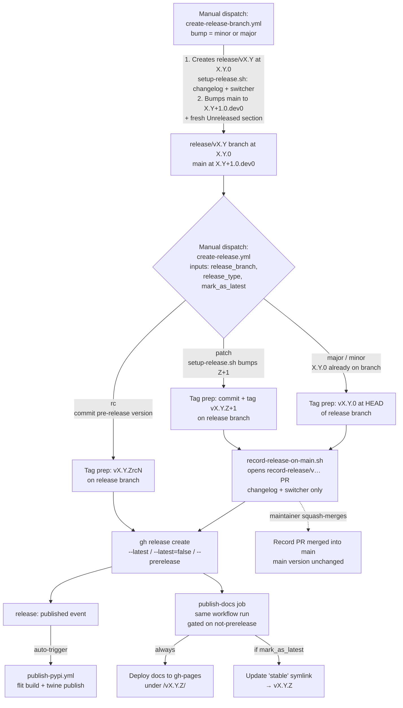
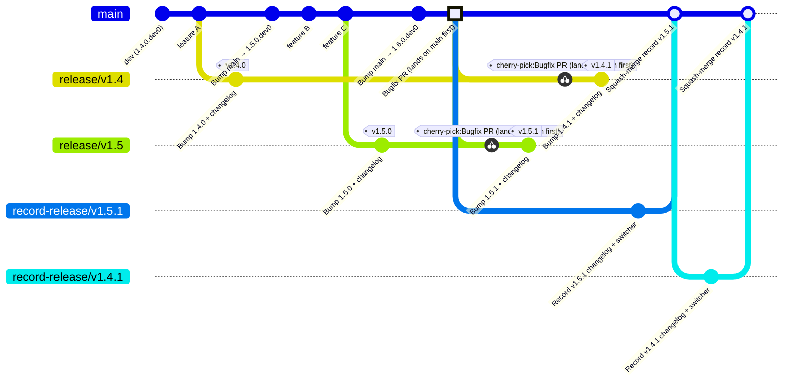

# Release process

This document shows how the release-related GitHub Actions workflows fit
together and what the resulting git history looks like. Two diagrams:

- The **workflow diagram** below shows what each workflow does and how they
  trigger each other.
- The **gitGraph** further down walks through a concrete two-family scenario
  (a bugfix backported from `main` to `release/v1.5` and `release/v1.4`).

## Workflow diagram

The PyPI publish and docs deploy fire **directly off the GitHub release**,
not off any merge into main. The `record-release/v…` PRs are bookkeeping
for main's changelog and switcher — they are not on the publishing critical
path. Release branches are **never** merged back into `main`.

## Worked example: bugfix backported across two release families

Scenario: `release/v1.4` has shipped `v1.4.0`. Development on `main`
continues at `1.5.0.dev0`. `release/v1.5` is cut, `v1.5.0` ships, and main
bumps to `1.6.0.dev0`. A bug is then discovered: the fix is merged to `main`
first, cherry-picked onto each release branch, and a patch release is cut
from each.

### Terminology: release family

A **release family** is the set of releases that share the same
`MAJOR.MINOR`. Each `release/vX.Y` branch is the home of exactly one family:

- The **1.4 family** lives on `release/v1.4` and contains every `v1.4.*` tag
  (`v1.4.0`, `v1.4.1`, …).
- The **1.5 family** lives on `release/v1.5` and contains every `v1.5.*` tag.
- `main` is always preparing the **next** family. When `release/v1.5` is cut,
  `create-release-branch.yml` immediately bumps main to `1.6.0.dev0`.

### Key design rules

1. **Main is always one minor ahead of the most recent release family.**
   `create-release-branch.yml` bumps main to `X.(Y+1).0.dev0` in the same
   run that creates the release branch. Releases never originate from
   `main`; they always come from a `release/vX.Y` branch.
2. **Release branches are never merged back into main.** Every full release
   (major, minor, and patch) opens a `record-release/v…` PR that brings
   only `docs/changelog.rst` and `docs/_static/switcher.json` to `main`.
   The version in `hydromt/__init__.py` on `main` is never changed by a
   release event.
3. **All development lands on `main` first.** Features and bugfixes are
   merged into `main` via normal PRs. When a fix needs to ship in an older
   release family, cherry-pick the merge commit onto the relevant
   `release/vX.Y` branch(es) and dispatch `create-release.yml` with
   `release_type = patch` against that branch. Never commit fixes
   directly to a release branch — this keeps `main` the single source of
   truth and avoids drift between families.

The developer dispatching `create-release.yml` chooses, via a
`mark_as_latest` checkbox, whether the GitHub release should be marked as
`latest` (and the docs `stable` symlink updated). For patches on older
families the developer normally **un**checks this so that the newest family
keeps owning `stable`.

### How the workflows fit together

- **`create-release-branch.yml`**:
  - Creates `release/vX.Y` at `X.Y.0` using `setup-release.sh` (version
    bump, changelog header rename, switcher entry).
  - In the same run, switches back to `main` and bumps it to
    `X.(Y+1).0.dev0` with a fresh `Unreleased` changelog section.
  - For `bump = minor`, takes main's current version as-is (main is already
    at the right minor). For `bump = major`, bumps the major and resets minor
    to 0.
  - Run once per family. Older release branches keep living independently.
- **`create-release.yml`** takes `release_branch`, `release_type`, and
  `mark_as_latest` as inputs. The same workflow services every release
  branch and every release type uniformly.
  - For `major`/`minor`: tags the `X.Y.0` commit already on the branch.
  - For `patch`: runs `setup-release.sh` to bump the patch, commit, then
    tags.
  - For `rc`: commits a pre-release version bump, tags, creates a
    pre-release on GitHub. No record-on-main PR; no docs published.
  - For all full releases: runs `record-release-on-main.sh` to open a
    `record-release/v…` PR (squash-merge) that brings changelog +
    switcher to main.
  - **`mark_as_latest` checkbox** controls the GitHub release `--latest`
    flag and whether the docs `stable` symlink is updated. Default `true`.
    Uncheck for patches on older families.
- The **`NEW_RELEASE` concurrency group** serializes release jobs across
  branches.
- **PyPI**: each tag's `release: published` event independently triggers
  `publish-pypi.yml`. All families get published regardless of
  `mark_as_latest`.
- **Bugfix cherry-picks**: there is no automated bugfix-commit backport
  workflow. The fix is cherry-picked onto each release branch by hand (or
  via a PR targeting the release branch). Only then is `create-release.yml`
  dispatched against that branch.
- If `create-release-branch.yml` fails after pushing the release branch but
  before bumping `main`, manually open a PR that sets main to
  `X.(Y+1).0.dev0` and adds an `Unreleased` section.
