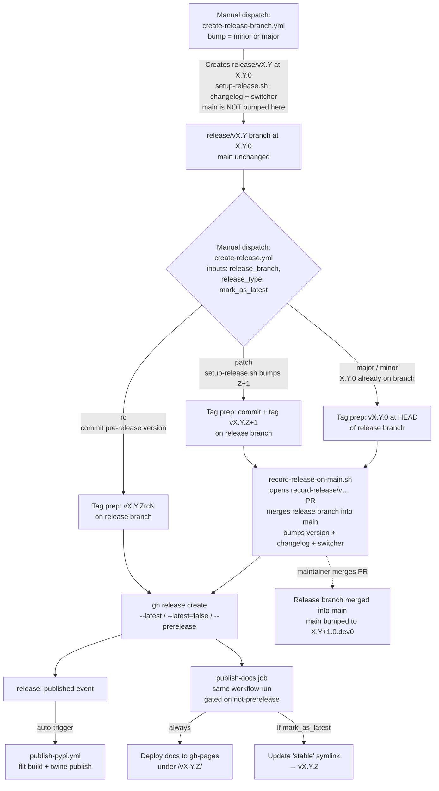
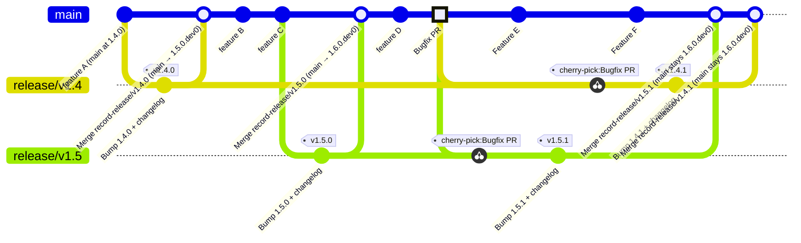

# Release process

This document shows how the release-related GitHub Actions workflows fit
together and what the resulting git history looks like. Two diagrams:

- The **workflow diagram** below shows what each workflow does and how they
  trigger each other.
- The **gitGraph** further down walks through a concrete two-family scenario
  (a bugfix backported from `main` to `release/v1.5` and `release/v1.4`).

## Workflow diagram

The PyPI publish and docs deploy fire **directly off the GitHub release**,
not off any merge into main. The `record-release/v…` PRs merge the release
branch back into `main` (carrying code changes, changelog, and switcher)
but are not on the publishing critical path.

## Example: bugfix backported across two release families

Scenario: `release/v1.4` has shipped `v1.4.0`. After the record-release PR
is merged, main is bumped to `1.5.0.dev0`. `release/v1.5` is cut, `v1.5.0`
ships, and the record-release PR bumps main to `1.6.0.dev0`. A bug is then
discovered: the fix is merged to `main` first, cherry-picked onto each
release branch, and a patch release is cut from each.

### Terminology: release family

A **release family** is the set of releases that share the same
`MAJOR.MINOR`. Each `release/vX.Y` branch is the home of exactly one family:

- The **1.4 family** lives on `release/v1.4` and contains every `v1.4.*` tag
  (`v1.4.0`, `v1.4.1`, …).
- The **1.5 family** lives on `release/v1.5` and contains every `v1.5.*` tag.
- `main` is always preparing the **next** family. When the first release
  from `release/v1.5` is merged back via its record-release PR, main is
  bumped to `1.6.0.dev0`.

### Key design rules

1. **Main is bumped to the next dev version by the record-release PR.**
   When a full release is published, `record-release-on-main.sh` creates a
   PR that merges the release branch back into `main`. This PR bumps main
   to `X.(Y+1).0.dev0` (if it isn’t already higher) and adds a fresh
   `Unreleased` changelog section. Releases never originate from `main`;
   they always come from a `release/vX.Y` branch.
2. **Release branches are merged back into main after each full release.**
   Every full release (major, minor, and patch) opens a
   `record-release/v…` PR that starts from the release branch and targets
   `main`. This PR carries any code changes that exist on the release
   branch back into `main`, along with the updated `docs/changelog.rst`
   and `docs/_static/switcher.json`. The version in `hydromt/__init__.py`
   on `main` is preserved if it is already at or above `X.(Y+1).0.dev0`;
   otherwise it is bumped as a safety net. Use a **regular merge** (not
   squash) to preserve the branch relationship in history.
3. **All development lands on `main` first.** Features and bugfixes are
   merged into `main` via normal PRs. When a fix needs to ship in an older
   release family, cherry-pick the merge commit onto the relevant
   `release/vX.Y` branch(es) and dispatch `create-release.yml` with
   `release_type = patch` against that branch. If a cherry-pick does not
   apply cleanly, the `record-release/v…` PR will carry the fix back to
   `main` after the patch release.

The developer dispatching `create-release.yml` chooses, via a
`mark_as_latest` checkbox, whether the GitHub release should be marked as
`latest` (and the docs `stable` symlink updated). For patches on older
families the developer normally **un**checks this so that the newest family
keeps owning `stable`.

### How the workflows fit together

- **`create-release-branch.yml`**:
  - Creates `release/vX.Y` at `X.Y.0` using `setup-release.sh` (version
    bump, changelog header rename, switcher entry).
  - Main is **not** bumped here. The version bump and fresh Unreleased
    section are applied when the record-release PR is merged after the
    first release from the family.
  - For `bump = minor`, takes main's current version as-is (main is already
    at the right minor). For `bump = major`, bumps the major and resets minor
    to 0.
  - Run once per family. Older release branches keep living independently.
- **`create-release.yml`** takes `release_branch`, `release_type`, and
  `mark_as_latest` as inputs. The same workflow services every release
  branch and every release type uniformly.
  - For `major`/`minor`: tags the `X.Y.0` commit already on the branch.
  - For `patch`: runs `setup-release.sh` to bump the patch, commit, then
    tags.
  - For `rc`: commits a pre-release version bump, tags, creates a
    pre-release on GitHub. No record-on-main PR; no docs published.
  - For all full releases: runs `record-release-on-main.sh` to open a
    `record-release/v…` PR that merges the release branch back into
    main (code changes + changelog + switcher). The PR branch starts
    from the release branch, not from main.
  - **`mark_as_latest` checkbox** controls the GitHub release `--latest`
    flag and whether the docs `stable` symlink is updated. Default `true`.
    Uncheck for patches on older families.
- The **`NEW_RELEASE` concurrency group** serializes release jobs across
  branches.
- **PyPI**: each tag's `release: published` event independently triggers
  `publish-pypi.yml`. All families get published regardless of
  `mark_as_latest`.
- **Bugfix cherry-picks**: there is no automated bugfix-commit backport
  workflow. The fix is cherry-picked onto each release branch by hand (or
  via a PR targeting the release branch). Only then is `create-release.yml`
  dispatched against that branch. If a cherry-pick doesn't apply cleanly,
  the fix can be applied directly to the release branch — the
  `record-release/v…` PR will carry it back to main after the release.
- If `create-release-branch.yml` fails after pushing the release branch,
  the release can still proceed normally — the record-release PR will
  bump main when the release is published.
