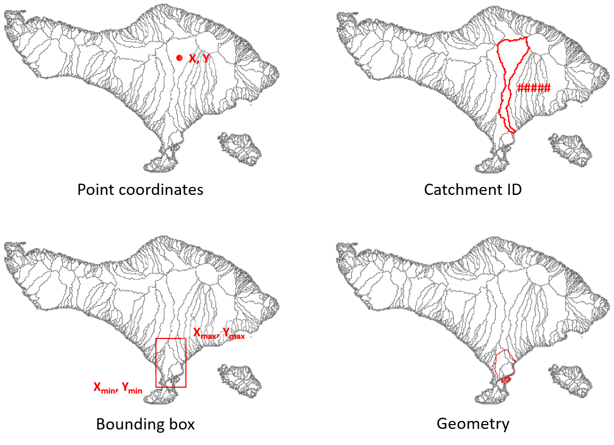

.. _cli:

Command Line Interface
======================
Configure workflow
------------------
The command line interface (CLI) provides a high-level interface to the different models and methods 
in HydroMT. Currently three methods are supported and explained below:

- **build** to prepare a model from scratch
- **update** to update specific component(s) of an existing model
- **clip** to extract a smaller sub-region of an existing model

To use the CLI, you need to open a command prompt (example Windows command prompt, Linux prompt, Anaconda prompt, .bat or .cmd files) and first 
activate the HydroMT python environment and then run the command line with the HydroMT method:

.. code-block:: console

    activate hydromt
    hydromt build --help

The choice of components to include when building or updating a model is defined in the :HydroMT configuration file.
The different methods and their command line arguments are described below.

.. _cli_build:

build
-----

To build a complete model from scratch using available data the build command can be used. 
The interface is identical for each model, but the configuration file has different 
options (see documentation of the individual models). The mandatory :ref:`region <region>` 
argument describes the region of interest. The build method will start by running the setup_basemaps 
component of the model in order to prepare the model schematization/grid based on the region arguments. 
The configuration file should then start by listing the setup_basemaps components and then all the components 
that the user wants to include during the build. If no specific configuration is provided, only the setup_basemaps 
component will be prepared.

.. include:: ../_generated/cli_build.rst

.. _cli_update:

update
-------

The update method can be used to update one or several model components. The model components are 
identical to the headers in the ini-files of each model. Options for a component 
can be set in the ini-file or provides via command line with the `c` and `opt` options if only one component 
is updated. For several, use the configuration file with the `i` option.

.. include:: ../_generated/cli_update.rst

.. _cli_clip:

clip
----

The clip method allows to clip a subregion from a model, including all static maps,
static geometries and forcing data. This method has only been implemented for the 
wflow model so far. The :ref:`region <region>` argument follows the same syntax as 
in the build method.

.. include:: ../_generated/cli_clip.rst

Region options
--------------

.. _region:

The region of interest can be described in three ways:

- based on **geospatial region** using a bounding box *bbox*, or geometry file *geom*:

    - ``{'bbox': [xmin, ymin, xmax, ymax]}``
    - ``{'geom': '/path/to/geometry_file'}``

- based on the **grid** of another model or raster file, e.g:

    - ``{'<model_name>': '/path/to/model_root'}``
    - ``{'grid': '/path/to/raster_file'}``

- Based on a **hydrographic region** using *basin*, *subbasin*, *interbasin*:

  A *basin* is defined by the entire area which drains to the sea or an inland depression.
  To delineate the basin(s) touching a region or point location, users can supply 
  one (or more) point location(s) or a region defined by a bounding box or a geometry file. 
  Alternatively, if the unique basin ID is known this can also be used.
  
    - ``{'basin': [x, y]}``
    - ``{'basin': [[x1, x2, ..], [y1, y2, ..]]}``
    - ``{'basin': [xmin, ymin, xmax, ymax]}``
    - ``{'basin': '/path/to/geometry_file'}``
    - ``{'basin': [ID1]}``
    - ``{'basin': [ID1, ID2, ..]}``

  To filter basins, variable-threshold pairs to define streams can be used in combination with
  a bounding box or geometry file, e.g.: ``'uparea':30`` to filter based on streams with 
  a minimum drainage area of 30 km2 or ``'strord':8`` to filter basins based on streams 
  with a minimal stream order of 8.
    
    - ``{'basin': [xmin, ymin, xmax, ymax], '<variable>': threshold}``

  To only select basins with their outlet location use ``'outlets': true`` in combination with
  a bounding box or geometry file
  
    - ``{'basin': [xmin, ymin, xmax, ymax], 'outlets': true}``

  A *subbasin* is defined by the area that drains into an outlet, stream or region. 
  Users can supply one (or more) point outlet location(s) or a region defined by a 
  bounding box or a geometry file. 
  
    - ``{'subbasin': [x, y]}``
    - ``{'subbasin': [[x1, x2, ..], [y1, y2, ..]]}``
    - ``{'subbasin': [xmin, ymin, xmax, ymax]}``
    - ``{'subbasin': '/path/to/geometry_file'}``

  To speed up the delineation process users can supply an estimated initial 
  bounding box in combination with all the options mentioned above.
  A warning will be raised if the bounding box does not contain all upstream area.

    - ``{'subbasin': [x, y], 'bounds': [xmin, ymin, xmax, ymax]}``

  The subbasins can further be refined based one (or more) variable-threshold pair(s) 
  to define streams, as described above for basins. If used in combination with point outlet locations, 
  these are snapped to the nearest stream which meets the threshold criteria. 
    
    - ``{'subbasin': [x, y], '<variable>': threshold}``

  An *interbasin* is defined by the area that drains into an outlet or stream and 
  bounded by a region and therefore does not necessarily including all upstream area. 
  Users should supply a bounding region in combination with stream and/or outlet arguments. 
  The bounding region is defined by a bounding box or a geometry file; streams by 
  (or more) variable-threshold pair(s) and outlet by point location coordinates. 
  Similar to subbasins, point locations are snapped to nearest downstream stream if 
  combined with stream arguments.

    - ``{'interbasin': [xmin, ymin, xmax, ymax], '<variable>': threshold}``
    - ``{'interbasin': /path/to/geometry_file, '<variable>': threshold}``
    - ``{'interbasin': [xmin, ymin, xmax, ymax], '<variable>': threshold, 'xy': [x, y]}``

  To only select interbasins based on the outlet location of entire basins use ``'outlets': true`` 
  
    - ``{'interbasin': [xmin, ymin, xmax, ymax], 'outlets': true}``

See also the *delineate basins* example and the :py:meth:`~hydromt.workflows.basin_mask.parse_region`
and :py:meth:`~hydromt.workflows.basin_mask.get_basin_geometry` methods. 

