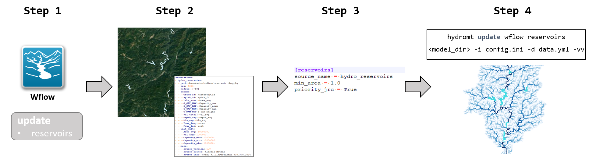

.. _intro:

User Guide
==========

From the user side, HydroMT is organised in the following way:

-  **Command Line Interface (CLI)**: high-level interface to HydroMT. It is used to run HydroMT methods
   such as build, update or clip for a specific model supported by the package, such as Wflow, Delwaq, SFINCS etc.
-  **CLI options**: When using the CLI, specific options such as which data sources to use, which components to include etc. 
   are provided in a *.ini* file. These options, organised in sections, vary for the different models and are documented 
   in the model components.
-  **Dataset list**: HydroMT can make use of various types of data sources such as vector data, GDAL rasters or NetCDF files. 
   The path and attributes of each of these dataset are listed in a *.yml* file. HydroMT already contains a list of default 
   global datasets that can be used as is. Local or other datasets can also be included by extending or using another local yaml file.

In general, the steps to use HydroMT are:

1. Select the model to use and the method (build, update...)
2. Choose the global or local datasets to use and add them to a yaml library if needed
3. Select the different model components and their options (in an ini file)
4. Run the HydroMT Command Line Interface

.. toctree::
   :maxdepth: 2

   data.rst
   model_build.rst
   model_update.rst
   model_clip.rst
   model_post.rst
   terminology.rst