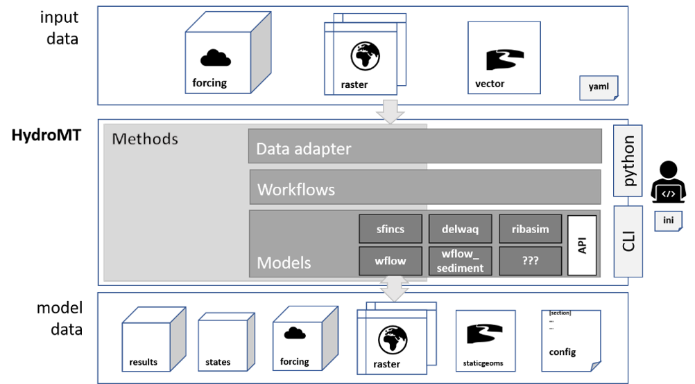

Model API
=========
The models submodule contains a basic general model API class which can easiliy be 
implemented and, if required extended, for individual models. The general model API 
contains methods to read, write and build models and ensures a common interface to 
different models. Workflows can be combined and wrapped into methods such as the 
build method of the model class.

HydroMT has a general model class which has identical methods for each model.
The most important methods are discussed here and model specific methods in each of 
subsections. A full list of all methods can be found in the reference API.

Model API:

* Properties:

    * :py:attr:`~hydromt.models.model_api.Model.root`: path to model root.

    * :py:attr:`~hydromt.models.model_api.Model.config`: :py:class:`dict` interface to the model configuration.

    * :py:attr:`~hydromt.models.model_api.Model.staticmaps`: a :py:class:`xarray.Dataset` interface to all model staticmaps. 

    * :py:attr:`~hydromt.models.model_api.Model.staticgeoms`: a :py:class:`dict` of :py:class:`geopandas.GeoDataFrame` interface to all model geometry files.

    * :py:attr:`~hydromt.models.model_api.Model.forcing`: a :py:class:`dict` of :py:class:`xarray.DataArray` interface to all model forcing files.

    * :py:attr:`~hydromt.models.model_api.Model.states`: a :py:class:`dict` of :py:class:`xarray.DataArray` interface to all model states files.

    * :py:attr:`~hydromt.models.model_api.Model.results`: a :py:class:`dict` of :py:class:`xarray.DataArray` and/or :py:class:`xarray.Dataset` interface to all model results files.

    * :py:attr:`~hydromt.models.model_api.Model.crs`: the model coordinate reference system.

    * :py:attr:`~hydromt.models.model_api.Model.bounds`: the model bounding box.

    * :py:attr:`~hydromt.models.model_api.Model.region`: the geomtery of model bounding box as :py:class:`geopandas.GeoDataFrame`.

* Methods:

    * :py:meth:`~hydromt.models.model_api.Model.build`: method to build a complete model from scratch.

    * :py:meth:`~hydromt.models.model_api.Model.setup_component`: method to update or setup a component once the basemaps have been setup.

    * :py:meth:`~hydromt.models.model_api.Model.read_config` / :py:meth:`~hydromt.models.model_api.Model.write_config`: parse model config to and from file.

    * :py:meth:`~hydromt.models.model_api.Model.get_config`: get a config option

    * :py:meth:`~hydromt.models.model_api.Model.set_config`: set a value to a config option

    * :py:meth:`~hydromt.models.model_api.Model.read_staticmaps` / :py:meth:`~hydromt.models.model_api.Model.write_staticmaps`: parse model maps to and from disk (often several files in model specific format).

    * :py:meth:`~hydromt.models.model_api.Model.set_staticmaps`: add a map to the model staticmaps.

    * :py:meth:`~hydromt.models.model_api.Model.read_staticgeoms` / :py:meth:`~hydromt.models.model_api.Model.write_staticgeoms`: parse model geometry data to and from file.

    * :py:meth:`~hydromt.models.model_api.Model.set_staticgeoms`: Add a geometry to the model staticgeoms.

    * :py:meth:`~hydromt.models.model_api.Model.read_forcing` / :py:meth:`~hydromt.models.model_api.Model.write_forcing`: parse model forcing to and from disk (often several files in model specific format).

    * :py:meth:`~hydromt.models.model_api.Model.set_forcing`: add a map to the model forcing.

    * :py:meth:`~hydromt.models.model_api.Model.read_states` / :py:meth:`~hydromt.models.model_api.Model.write_states`: parse model states to and from disk (often several files in model specific format).

    * :py:meth:`~hydromt.models.model_api.Model.set_forcing`: add a map to the model states.

    * :py:meth:`~hydromt.models.model_api.Model.read_results`: parse model results from disk (often several files in model specific format).

    * :py:meth:`~hydromt.models.model_api.Model.set_results`: add a map to the model states.

