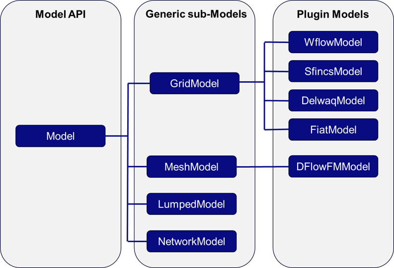
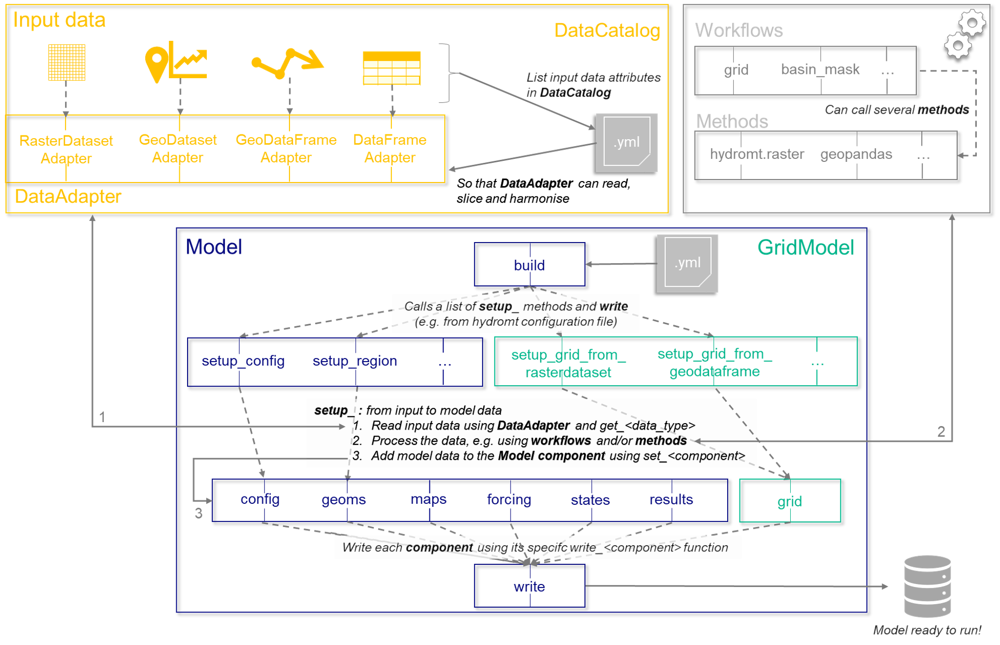

.. currentmodule:: hydromt

.. _plugin_quickstart:

================================
Starting your own HydroMT Plugin
================================

This page gives you some tips and tricks on how to use HydroMT for your own model and start your own plugin. Before reading this,
you should already know a little about HydroMT, so please check out at least the :ref:`intro_user_guide` and the :ref:`model_main`
section.

In short, there are three important concepts in HydroMT core that are important to cover:

- ``DataAdapters`` and ``DataCatalog``: These are what basically hold all information about how to approach and read data as well as some of the metadata
  about it. While a lot of the work in HydroMT happens here, plugins or users shouldn't really need to know about these beyond using
  the proper ``data_type`` in their configuration. ``DataCatalog`` are basically just a thin wrapper around the ``DataAdapters`` that does some book keeping.
- ``Workflows``: These are functions that transform input data and can call a set of methods to for example, resample, fill nodata, reproject, derive
  other variables etc. The core has some of these workflows but you may need new ones for your plugin.
- ``Model``: This is where the magic happens (as far as the plugin is concerned). We have provided some generic models that you can
  override to get basic/generic functionality, but using the model functionality is where it will be at for you. The scheme below lists the current
  relationship between the HydroMT ``Model`` and generic sub-Model classes and the know plugins.

  Schematic of Model and plugin structure of HydroMT

Getting started
===============

Plugin or no plugin ?
---------------------
You've discovered HydroMT and would like to use it for your own model and wonder how to get started about it?
Well the first thing you should ask yourself is if you need a plugin or not. To quote our :ref:`intro_user_guide`::

  HydroMT defines any model instance through the model-agnostic Model API
  based on several components: maps, geometries, forcings, results, states,
  and the model simulation configuration. For different types of general
  model classes (i.e., gridded, lumped, mesh and network models) additional
  model components have been defined. Each component is represented with a
  specific Python data object to provide a common interface to different model
  software. Model instances can be built from scratch, and existing models can
  be updated based on a pipeline of methods defined in a model configuration
  .yaml file.

  While HydroMT provides several general model classes that can readily be used, it can also be
  tailored to specific model software through a plugin infrastructure. These plugins have the same
  interface, but with model-specific file readers, writers and workflows.

As mentioned above, HydroMT interacts with models using the ``Model`` API class and also provides several sub-model classes:
``GridModel``, ``MeshModel``, ``LumpedModel``, ``NetworkModel``. Using these sub-model classes, it might be that actually you are
already able to prepare most and if you're lucky all of the data you need to build your own model. The only thing is that
these generic classes write model data in netcdf, geojson (or other formats supported by geopandas), or for configuration
in either yaml, toml or ini file format. So in case your model needs different file formats, you will need to convert or
write the output files in different formats.

Another advantage of writting your own plugin is that other users from the same model can easily build instances of that model
re-using the plugin. So for example, converting from netcdf to model specific file format, using pre-defined HydroMT building
configuration templates or parameter default values, but also using more instinctive and guided model building methods.

This is maybe a little more advanced but let's say that your model is a ``GridModel`` for which you need to prepare a *landuse*
classification map (for which resampling should be done using *mode* to avoid creating new imaginary land use classes which you
would do if you would use e.g., *average*) and two landuse parameters roughness *N* and infiltration *inf*. Well, using HydroMT generic
methods, for your user, the build configuration file would look like this:

.. code-block:: yaml

  setup_grid_from_rasterdataset:
    raster_fn: vito
    fill_method: nearest
    reproject_method: mode
    rename:
      vito: landuse

  setup_grid_from_raster_reclass:
    raster_fn: vito
    reclass_table_fn: vito_reclass
    reclass_variables:
      - manning
      - infiltration
    reproject_method:
      - average
      - average
    rename:
      manning: N
      infiltration: inf

While in your plugin, you could make it easier for your user by creating simplified function(s) re-using or wrapping the core
methods. There is an example in the :ref:`setup methods section <plugin_setup>` on how the python code of the function would
look like, but for the user, the same step could then look like:

.. code-block:: yaml

  setup_landuse:
    landuse_fn: vito
    reclass_table_fn: vito_reclass

Finally, with the generic methods and sub-model classes of HydroMT, we try to support a certain range of data processing methods.
If you find that there is no method available for your case, you can always open an issue and if we think your proposed method can
be re-used by others, it could be added to the core. However, for some complex or very specific data processing, this will not be
the case. For example, if your model requires a specific soil parameter that can be computed using only specific equation(s) based
on soil properties data. In these cases, you can either pre-compute your parameter and use the core method to
resample/extract, or write down your specific workflow/equation in your model plugin.

To conclude, before getting started **you should ask yourself these questions**:

  1. Does HydroMT generic ``Model`` and sub-model classes allow me to prepare most of the data for my model?
  2. Does my model have model-specific file formats which are different from the HydroMT defaults?
  3. Does my model require complex data processing workflows that are not covered (or will not be covered) by the generic model classes?
  4. Will there be a lot of users for my model?

And depending on the answers, you can decide to start your own plugin yes or no.
Below are a couple of advantages and drawbacks of making your own plugin:

*Advantages*

- HydroMT outputs are in the correct file format so my freshly built model is ready to run.
- All required input data can be prepared by HydroMT, even using specific or complex processing methods/workflows.
- Templates and easy to use/understand functions are more easily available.
- Maintained and central place for model specific functions/workflows (eg reading/writting in correct format etc.)

*Drawbacks*

- Need to create and develop a plugin repository.
- Need to support and maintain the plugin repository.

.. _plugin_create:

Create your own plugin repository
---------------------------------
HydroMT makes it pretty easy to create your own plugin and we are quite flexible on how you would like to organise and maintain
your plugin. Below you can find the minimum requirements to register your own new model plugin for HydroMT.

In case, you want to start creating your own package or GitHub repository from scratch, we have also prepared a cookiecutter template
to help you set up a whole Github package for your plugin including minimal testing and documentation by just filling out a couple of
questions :) .

Requirements
^^^^^^^^^^^^
You do not necessarily need to developp an entire new repository to create a HydroMT plugin. Actually all you need to do is to
instantiate a new HydroMT ``Model`` class (eg *WflowModel*) in a python script and register it properly. Currently HydroMT uses the
`entrypoints` package to advertise its, well, entrypoints. Entrypoints are how you can tell HydroMT core about your plugin and they
can be defined within your package setup definition file (typically your pyproject.toml for pypi packages). As an example we can look
at the current ``hydromt_wflow`` model. Specifically it's this line in the pyproject.toml (for pypi project, this could differ if you
use other tools to publish or install your package like poetry):

.. code-block:: toml

	[project.entry-points."hydromt.models"]
	wflow = "hydromt_wflow.wflow:WflowModel"

This snippet will tell HydroMT core three things:

1. there will be a new HydroMT plugin / model class ``WflowModel`` in this repository called "wflow" that HydroMT core can use for example via command line.
2. it is located in the file hydromt_wflow//wflow.py (or in python import term hydromt_wflow.wflow)
3. it implements the new plugin class ``WflowModel`` in the ``hydromt.models`` API

Now, how do you define the new plugin ``Model`` class. To make sure that your model is compatible with HydroMT core, you can use either the
``Model`` class of HydroMT core as a base or one of its sub-model classes: ``GridModel`` for regular gridded or distributed models, ``MeshModel``
for unstructured grid(s) models, ``LumpedModel`` for lumped or semi-distributed models or ``NetworkModel`` for network models. This allows you
to use the HydroMT model class methods as well as create any functionality on top of that. To define your new model class, e.g. *WflowModel*,
you should in the python script that is referenced by the entry-point define at least:

.. code-block:: python

  from hydromt.models import GridModel

  class WflowModel(GridModel):
    """ This is the HydroMT Wflow Model class. """

    _NAME = "wflow"

And that's it! If everything has gone well, you should be able to access your code through HydroMT now!

.. NOTE::

  If you want to mix functionalities from different sub-model classes, e.g. your model contains both regular grids and semi-distributed units, most model classes also
  provide ``Mixin`` variants that you can use to mix and match a bit more modularly. This is actually how the generic sub-classes are defined,
  as a mix of the main HydroMT ``Model`` class and the ``Mixin`` of the additionnal new component defining then:

  .. code-block:: python

    class GridModel(Model, GridMixin):

.. TIP::

  Choosing the right HydroMT Model or submodel class for your plugin depends on your main model characteristics. Each sub-model class implements
  a new HydroMT Model component, ``grid`` for ``GridModel`` or ``mesh`` for ``MeshModel`` and adds the accompanying setup, read and write methods.
  So choosing the one or the other, or adding a Mixin depends on what type of model or input data strucuture you need to prepare. Note that if your
  Model class is defined as (1) *PluginModel(GridModel)* or (2) *PluginModel(Model, GridMixin)*, in both cases the ``grid`` object and relative methods
  are available. The main difference is the dominant object for your model in case of (2) will be ``grid`` and in case of (1) the ``region``.
  IE when looking for example for the model CRS property, in case of (1) the crs will be grid.crs and in case of (2) region.crs. Also, in
  update mode, in case of (2), no additional data can be added to your model if the grid object is not yet defined (ie your model grid extent and
  resolution does not yet exist).

Typical HydroMT repository structure
^^^^^^^^^^^^^^^^^^^^^^^^^^^^^^^^^^^^
With HydroMT and some of its plugin, we usually use a classic folder structure and file organisation. It not mandatory to follow this structure
But if you choose to, a classic folder structure and files for a HydroMT plugin (eg mymodel) looks like this:

- **docs**: folder containing your documentation pages.
- **examples**: folder containing example models, templates for building/updating models, jupyter notebooks.
- **tests**: folder containing your test scripts.
- *pyproject.toml*: your build-system requirements for your python package (used by pypi and conda).
- *README.md*: your landing documentation page for your repository.
- *LICENSE*: license file for your repository.
- **hydromt_mymodel**: folder containing the functions for your plugin.

  - *__init__.py*: init python script used when importing the *hydromt_mymodel* package in a python script.
  - *mymodel.py*: your main script where you will your plugin `Model` class (*MyModelModel*) and main functions (read/write/setup).
  - **workflows**: folder contaning python scripts for data processing functions.
  - **data**: folder containing model building templates and default values or data for your plugin. For example, it is usually
    easier to update an existing template configuration file of your model rather than building it from scratch. You can store such
    a template in that folder. If your model has default values for some parameters, you can also store them here, ideally with a
    model data catalog to read the correponding files.

Using the cookiecutter template
^^^^^^^^^^^^^^^^^^^^^^^^^^^^^^^
To make it easier to get started we have provided a `cookiecutter <https://github.com/cookiecutter/cookiecutter>`_ template to help you get started.
The template itself is located at `https://github.com/Deltares/hydromt-plugin-template <https://github.com/Deltares/hydromt-plugin-template>`_.

This cookiecutter template contains:
  - classic HydroMT folder structure.
  - minimum definition of a new HydroMT plugin sub-model class and entrypoint registry.
  - working pyproject.toml to install and publish your plugin python package.
  - working minimum tests including GitHub workflow.
  - working minimum documentation including GitHub workflow.
  - code formatting workflow.
  - templates for GitHub Issues and Pull Requests.

So almost everything to get a working new python package for your HydroMT plugin! All you need is to define your model specific HydroMT functions
and well, if you wish to make it open for other users, choose an appropriate license.

To use it you must first install cookiecutter itself like so:

.. code-block:: console

	$ pip install cookiecutter

After that navigate to the folder in your terminal where you want to create the project. After doing that, all you need to do is run the
following command:

.. code-block:: console

	$ cookiecutter https://github.com/Deltares/hydromt-plugin-template

You will be asked some questions and the template will be generated for you!
In those questions, suggestions will be shown to guide you, just replace the word *plugin* in the suggestions by your own plugin or model name
(eg *mymodel*) and the host GitHub organisation or user from *Deltares* to your own GitHub name or organisation (eg *savente93*).

Here are some detailed information about what each question implies:

- **project_name**: The name of your GitHub project (this will be used as the title of your GitHub repository/README). Eg *HydroMT MyModel*
- **project_slug**: The slug of your project (this will be used as the name of the pypi/conda package). Eg *hydromt_mymodel*
- **project_url**: The url of your project (this will be used as the url of the github repository). Eg *https://github.com/savente93/hydromt_mymodel*
- **docs_url**: The url of the documentation of your project (this will be used as the url of the documentation). Eg *https://savente93.github.io/hydromt_mymodel*
- **model_classname**: The name of the new HydroMT Model subclass that you are creating. Eg *MyModelModel*
- **model_type**: Type of HydroMT model corresponding to your model, one of [``Model``, ``GridModel``, ``MeshModel``, ``LumpedModel``, ``NetworkModel``] (!careful with syntax!). Eg *GridModel*
- **model_shortname**: The short name of your model. This will be used as the HydroMT Command Line name of your plugin and as the name of the main python file of
  your project (which will contain the definition of your new Model class). Eg *mymodel*
- **project_tagline**: A short tagline (short description phrase) for your project. Eg *A HydroMT plugin for MyModel models.*
- **project_version**: The version of your project. Eg *0.1.0*

Let's say you just created the plugin called `hydromt_mymodel` before you can start using it you'll need to initialise git within it like so:

.. code-block:: console

	$ cd hydromt_mymodel
	$ git init

If your project has dependencies, you can add them in the pyproject.toml under the `dependencies` array. If you have `tomli` installed, you can
use the `make_env.py` script to generate a conda environment specification see :ref:`The developper installation page <dev_install>` for
more information on how to use this script.

Now, assuming that you've made a repository in your personal GitHub repository (eg user savente93) you just need to add it as a remote in the
repository and push it (for an organisation, you will need specific rights to do this).

.. code-block:: console

	$ git remote add origin https://github.com/savente93/hydromt_mymodel
	$ git push

After this you can open up the github repository website, and you should see your generated project. You are now ready to start developing your own
plugin! Well done, and good luck!

Conventions and tips to develop your own plugin
================================================
To take back the schematic overview of the HydroMT package architecture (figure below), HydroMT is organized in the following way:

  - **Input data**: HydroMT is data-agnostic through the ``DataAdapter``, which reads a wide range of data formats and unifies the input data (e.g.,
    on-the-fly renaming and unit conversion). Datasets are listed and passed to HydroMT in a ``DataCatalog`` yaml file.

    HydroMT core should normally take care of everything your plugin needs here, so the only thing you should know is how to use it correctly
    for example in your model methods and workflows (see below).
  - **Model**: HydroMT defines any model instance through the model-agnostic ``Model`` API based on several components: maps, geometries, forcings,
    results, states, and the model simulation configuration. For different types of general model classes (i.e., gridded, lumped, mesh and network
    models) additional model components have been defined. Each component is represented with a specific Python data object to provide a common interface
    to different model software.

    We will see below how to initialise properly the ``Model`` class and its main attributes as well as how to work with the
    model components in the :ref:`Model class and components <plugin_components>` section.
  - **Methods and workflows**: Most of the heavy work in HydroMT is done by Methods and workflows, indicated by the gear wheels in the schematic of
    HydroMT architecture below. Methods provide the low-level functionality such as GIS rasterization, reprojection, or zonal statistics. Workflows combine
    several methods to transform data to a model layer or postprocess model results.

    In the :ref:`data processing section <plugin_workflows>`, we will see
    some examples and best practices of how to process and add data to your model.
  - **Command line and Python interface**: The CLI is a high-level interface to HydroMT. It is used to run HydroMT methods such as build, update or clip.
    While most common functionalities can be called through the CLI, the Python interface offers more flexibility for advanced users. It allows you to e.g.
    interact directly with a model component Model API and apply the many methods and workflows available.

    We saw in the :ref:`section above <plugin_create>`
    how to properly instantiate your plugin class and register it to HydroMT entrypoints.

.. figure:: ../_static/Architecture_model_data_input.png

  Schematic of HydroMT architecture

.. _plugin_components:

Model class and components
--------------------------
In this section, we will detail the bottom part of the schematic ie how to initialise your HydroMT Model class for your plugin, the main properties and how to
work with its model components.

Initialisation
^^^^^^^^^^^^^^
In the :ref:`create plugin section <plugin_create>`, we already saw which HydroMT ``Model`` class to choose for your plugin. Here we will focus on additionnal
properties and the initiliasation of your new Model subclass.

To fully initiliase your new subclass (eg *MyModelModel*), you need to initialise a couple of high level properties and in some cases, you may wish to modify
the default initialisation function of you parent class (the HydroMT core class you choose, ``Model`` or ``GridModel`` etc.).

.. TIP::

  In python, a child class (eg *MyModelModel(Model)*), inherits all methods and properties of the parent class (``Model``). If you wish to overwrite completely one
  of the parent method (eg ``setup_region``), you can just redefine the function in the child class using the name (``setup_region``). You can also decide to partly
  re-use the parent function and for example add some extra steps, change the default values or the docstring of the function. For this, you can redefine the
  function in the child class, and within the redefined function, call the parent one use *super()* python class attribute (*super().setup_region*). You will see
  an example below for the initialisation function ``__init__`` .

Below are the properties and initialisation function, to set for your new plugin *MyModelModel* class:

.. code-block:: python

  from hydromt.models import Model
  from os.path import abspath, join, dirname

  class MyModelModel(Model):
    """This is the HydroMT MyModel class for MyModel models."""

    ### Any global class variables your model should have go here ###
    # shortname of your model / hydromt model name for CLI
    _NAME: str = "mymodel"
    # Default filename for mymodel configuration file / run settings
    _CONF: str = "model.yaml"
    # Path to default model building for my model / eg template configuration files to edit
    # default paremter values etc.
    # This folder in many existing plugins is usually placed at the same level of the class name
    # definition in a floder called "data".
    _DATADIR: Path = abspath(join(dirname(__file__), "data"))
    # tell hydroMT which methods should receive the res and region arguments from CLI
    _CLI_ARGS: Dict[str, str] = {"region": "setup_region", "res": None}

    ### Name of default folders to create in the model directory ###
    # When initiliasing a new model for a specific region, the folders
    # int he list will be created
    _FOLDERS: List[str] = []

    ### Name of defaults catalogs to include when initialising the model ##
    # For example to include model specific parameter data or mapping
    # These default catalogs can be placed in the _DATADIR folder.
    _CATALOGS: List[str] = [join(_DATADIR, "parameters_data.yml")]

    def __init__(
        self,
        root: Optional[str] = None,
        mode: str = "w",
        config_fn: Optional[str] = None,
        data_libs: Optional[Union[List[str], str]] = None,
        logger: logging.Logger = logger,
    ):
        """
        The mymodel model class MyModelModel.

        Contains methods to read, write, setup and update mymodel models.

        Parameters
        ----------
        root : str, Path, optional
            Path to the model folder
        mode : {'w', 'w+', 'r', 'r+'}, optional
            Mode to open the model, by default 'w'
        config_fn : str, Path, optional
            Path to the model configuration file, by default None to read
            from template in build mode or default name in update mode.
        data_libs : list of str, optional
            List of data catalogs to use, by default None.
        logger : logging.Logger, optional
            Logger to use, by default logger
        """
        # Add model _CATALOGS to the data_libs, if you wish to use default catalogs
        if self._CATALOGS:
            if isinstance(data_libs, str):
                data_libs = [data_libs]
            if data_libs is None:
                data_libs = []
            data_libs = data_libs + self._CATALOGS

        # Call the parent class initialisation method using super()
        super().__init__(
            root=root,
            mode=mode,
            config_fn=config_fn,
            data_libs=data_libs,
            logger=logger,
        )

        # If your model needs any extra specific initialisation parameter or step
        # add them here
        # Example: an extra propery or default value, or a new HydroMT component

        # end of the __init__ function

Model components
^^^^^^^^^^^^^^^^
A reminder from the :ref:`Model guide <model_interface>`:

  HydroMT defines any model through the model-agnostic Model API based on several *general* components and *computational* unit components.
  Each component represents a specific model data type and is parsed to a specific Python data object.
  The general components are **maps** (raster data), **geoms** (vector data), **forcing**, **results**, **states**, and **config**
  (the model simulation configuration). These are available to all model classes and plugins.
  The computational components are different for different types of models: i.e. **grid** for distributed or grid models,
  **response_units** for lumped or semi-distributed models, **mesh** for mesh or unstructured grid models, and **network** for
  network models (to be developed).

So typically, when you want to add data to your model (DEM, precipitation, parameters etc.), you add data to one of the
specific Model component. To add data, to a component, the ``set_<component>`` methods are you use and each of the components can be
read and written using the specific ``read_<component>`` and ``write_<component>`` methods.

The table below lists the base model components common to all model classes.
All base model attributes and methods can be found in the :ref:`API reference <model_api>`

.. list-table::
   :widths: 10 25 20 15
   :header-rows: 1

   * - Component
     - Explanation
     - Python object
     - API
   * - maps
     - Map / raster data (resolution and CRS may vary between maps)
     - Dictionnary of xarray.DataArray and/or xarray.Dataset
     - | :py:attr:`~Model.maps`
       | :py:func:`~Model.set_maps`
       | :py:func:`~Model.read_maps`
       | :py:func:`~Model.write_maps`
   * - geoms
     - Static (1 or 2D) vector data
     - Dictionnary of geopandas.GeoDataFrame
     - | :py:attr:`~Model.geoms`
       | :py:func:`~Model.set_geoms`
       | :py:func:`~Model.read_geoms`
       | :py:func:`~Model.write_geoms`
   * - forcing
     - (Dynamic) forcing data (meteo or hydrological for example)
     - Dictionnary of xarray.DataArray and/or xarray.Dataset
     - | :py:attr:`~Model.forcing`
       | :py:func:`~Model.set_forcing`
       | :py:func:`~Model.read_forcing`
       | :py:func:`~Model.write_forcing`
   * - results
     - Model output
     - Dictionnary of xarray.DataArray and/or xarray.Dataset
     - | :py:attr:`~Model.results`
       | :py:func:`~Model.set_results`
       | :py:func:`~Model.read_results`
   * - states
     - Initial model conditions
     - Dictionnary of xarray.DataArray and/or xarray.Dataset
     - | :py:attr:`~Model.states`
       | :py:func:`~Model.set_states`
       | :py:func:`~Model.read_states`
       | :py:func:`~Model.write_states`
   * - config
     - Settings for the model kernel simulation or model class
     - Dictionnary (Any)
     - | :py:attr:`~Model.config`
       | :py:func:`~Model.set_config`
       | :py:func:`~Model.read_config`
       | :py:func:`~Model.write_config`

For each generalized model class, the respective computational unit components exist:

.. list-table::
   :widths: 15 15 25 20 15
   :header-rows: 1

   * - Component
     - Model class
     - Explanation
     - Python object
     - API
   * - grid
     - :ref:`GridModel <grid_model_api>`
     - Static gridded data with on unified grid
     - xarray.Dataset (compatible with hydromt.raster.RasterDataset)
     - | :py:attr:`~GridModel.grid`
       | :py:func:`~GridModel.set_grid`
       | :py:func:`~GridModel.read_grid`
       | :py:func:`~GridModel.write_grid`
   * - response_units
     - :ref:`LumpedModel <lumped_model_api>`
     - Static lumped data over the response_units
     - xarray.Dataset (compatible with hydromt.vector.GeoDataset)
     - | :py:attr:`~LumpedModel.response_units`
       | :py:func:`~LumpedModel.set_response_units`
       | :py:func:`~LumpedModel.read_response_units`
       | :py:func:`~LumpedModel.write_response_units`
   * - mesh
     - :ref:`MeshModel <mesh_model_api>`
     - Static mesh (unstructured grid(s)) data
     - xugrid.UgridDataset
     - | :py:attr:`~MeshModel.mesh`
       | :py:func:`~MeshModel.set_mesh`
       | :py:func:`~MeshModel.get_mesh`
       | :py:func:`~MeshModel.read_mesh`
       | :py:func:`~MeshModel.write_mesh`

Reading & Writing model components
^^^^^^^^^^^^^^^^^^^^^^^^^^^^^^^^^^

Because the way that models consume data is often model software specific, the main part of writing a plugin is writing the
Input/Output (IO) methods to prepare data exactly as your model expects them, in the correct format. To do this you'll
be overwriting most ``read_<component>`` or ``write_<component>`` methods in your model class. That will ensure that the
data comes in and goes out expecting exactly as you want.

In the default HydroMT CORE read and write methods, xarray objects are written as netcdf files, ``geoms`` as GeoJSON files by
default but any geopandas driver is allowed, and ``config`` either as TOML, YAML or INI file. So again, you could decide to
completely overwrite the parent read and write methods or change the defaults.

Eg if your geoms should be written in GeoPackage format rather than GeoJSON and in a geometry folder in your model:

.. code-block:: python

  def write_geoms(self):
    """ Write model geometries to a GeoPackage file at <root>/geometry/<name>.gpkg """

    super().write_geoms(
      fn = "geometry/{name}.gpkg",
      driver = 'GPKG'
    )

If you are writting your own read/write functions, some good pratice steps of the function:

1. For writing, check first if the object you are writing is not empty, then you can pass. Example:

.. code-block:: python

  if len(self.geoms) == 0:
    self.logger.debug("No geoms data found, skip writing.")
    return

2. For reading or writing, check that you have the right permission. For example, in build mode ('w' or 'w+'),
the model should be empty, so you should not be able to read existing model files. In some cases, python
users may only want to read a model using HydroMT to visualise or plot data. As a protection, the model
can then be opened in read only mode ('r') and HydroMT should not be able to overwrite any data. HydroMT
`Model` class has two porperties you can use to check for this:

- `self._assert_read_mode` if a model can be read
- `self._assert_write_mode` if a model can be written
3. If needed transform, and write the component to the right format and file(s). Don't hesitate to put
some logger information for your user.

Set model components
^^^^^^^^^^^^^^^^^^^^
To add data to one of the model component (e.g. a DEM raster data to maps), the ``set_<component>`` methods should be used.
In the background, the actual data is stored not directly in the components but in a **placeholder** property
(``_maps`` for ``maps``). And the component, ``maps``, actually just goes and fetch the data from the placeholder ``_maps`` or
in read mode, starts reading the component.

.. code-block:: python

  @property
  def maps(self) -> Dict[str, Union[xr.Dataset, xr.DataArray]]:
      """Model maps. Returns dict of xarray.DataArray or xarray.Dataset."""
      if self._maps is None:
          self._maps = dict()
          if self._read:
              self.read_maps()
      return self._maps

Using a placeholder allows to initiate reading when possible (e.g. in update mode 'r+'), the first time when the
component is called, to avoid unintentiously overwritting data stored, and allows to add some check or transformation
when adding data to a component using the ``set_<component>`` methods.

So it is usually highly recommended, in your plugin to always use the component (``maps``) and to only modify its placholder
using the ``set_<component>`` methods. Example of ``set_maps``:

.. code-block:: python

  def set_maps(
    self,
    data: Union[xr.DataArray, xr.Dataset],
    name: Optional[str] = None,
    split_dataset: Optional[bool] = True,
  ) -> None:
    """Add raster data to the maps component.

    Dataset can either be added as is (default) or split into several
    DataArrays using the split_dataset argument.

    Arguments
    ---------
    data: xarray.Dataset or xarray.DataArray
        New forcing data to add
    name: str, optional
        Variable name, only in case data is of type DataArray or if a Dataset is
        added as is (split_dataset=False).
    split_dataset: bool, optional
        If data is a xarray.Dataset split it into several xarray.DataArrays.
    """
    data_dict = _check_data(data, name, split_dataset)
    for name in data_dict:
        if name in self.maps:  # trigger init / read
            self.logger.warning(f"Replacing result: {name}")
        self._maps[name] = data_dict[name]

Additional Model properties
^^^^^^^^^^^^^^^^^^^^^^^^^^^
You can have a look at the :ref:`Model API documentation <model_api>` to find out all other properties of the ``Model`` class and
the other subclasses. Apart from the components here are a couple of useful properties to use when developping your plugin:

- :py:attr:`~Model.root`: path to the root folder of the model instance you are working with.
- :py:attr:`~Model.crs`: the reference coordinate system (pyproj.CRS) of the model.
- :py:attr:`~Model.region`: the region (GeoDataFrame) of your model, stored in :py:attr:`~Model.geoms`.
- :py:attr:`~Model.data_catalog`: the current data catalog you can use to add data to your model.
- :py:attr:`~Model.logger`: the HydroMT logger object for your model instance.
- :py:attr:`~Model._read`: flag if the model is in read mode ('r' or 'r+' when initialising).
- :py:attr:`~Model._write`: flag if the model is in write mode ('w' or 'w+' when initialising).

Some submodel classes can have additional attributes based on their additional components, so check out the :ref:`API reference <model_api>`.

Adding a new property or component
^^^^^^^^^^^^^^^^^^^^^^^^^^^^^^^^^^
If you wish to add additional properties or attributes to your plugin Model subclass, you can either decide to add simple
attributes directly in the initiliasation function ``__init__`` or define specific properties. Example for a shortcut to the basin
vector in the geoms object:

.. code-block:: python

  @property
  def basins(self) -> gpd.GeoDataFrame:
    """Returns a basin(s) geometry as a geopandas.GeoDataFrame."""
    # Check in geoms
    if "basins" in self.geoms:
      gdf = self.geoms["basins"]
    else:
        self.logger.warning(
            f"Basin map {self._MAPS['basins']} not found in maps or geoms."
        )
        gdf = gpd.GeoDataFrame()
    return gdf

In most cases, we hope that the components defined in HydroMT `Model` classes (``config``, ``geoms``, ``maps``, ``forcing``, ``states``,
``results``) and its generic subclasses (``grid``, ``mesh``, ``response_units``) should allow you to store any data required by your
model in a proper way. If it is not the case, you can always define your own new model components by respecting the following steps
(example if your model has a lot of 2D non-geospatial tabular data that could nicely be stored as pandas.DataFrame objects, *tables*):

1. Initiliase your new component placeholder in the ``__init__`` function, if possible with None.

.. code-block:: python

  self._tables = None

2. Define the component itself as a new property, that looks for the placeholder and tries reading if empty in read mode.

.. code-block:: python

  @property
  def tables(self) -> Dict[str, pd.DataFrame]:
      """Returns a dictionary of pandas.DataFrame tabular files."""
      if self._tables is None:
        self._tables = dict()
        if self._read:
          self.read_tables()
      return self._tables

3. Define a reading and a writting method for your new component.

.. code-block:: python

  def read_tables(self, **kwargs):
    """Read table files at <root> and parse to dict of dataframes"""
    if not self._write:
      self._tables = dict()  # start fresh in read-only mode

    self.logger.info("Reading model table files.")
    fns = glob.glob(join(self.root, f"*.csv"))
    if len(fns) > 0:
      for fn in fns:
        name = basename(fn).split(".")[0]
        tbl = pd.read_csv(fn)
        self.set_tables(tbl, name=name)

  def write_tables(self):
    """Write tables at <root>."""
    self._assert_write_mode
    if len(self.tables) > 0:
      self.logger.info("Writing table files.")
      for name in self.tables:
        fn_out = join(self.root, f"{name}.csv")
        self.tables[name].to_csv(fn_out, sep=",", index=False, header=True)

4. Define a set function in order to add or update data in your component.

.. code-block:: python

  def set_tables(self, df: pd.DataFrame, name:str):
    """Add table <pandas.DataFrame> to model."""
    if not (isinstance(df, pd.DataFrame) or isinstance(df, pd.Series)):
      raise ValueError("df type not recognized, should be pandas.DataFrame or pandas.Series.")
    if name in self._tables:
      if not self._write:
        raise IOError(f"Cannot overwrite table {name} in read-only mode")
      elif self._read:
        self.logger.warning(f"Overwriting table: {name}")
    self._tables[name] = df

.. _plugin_workflows:

Data processing: setup methods and workflows
--------------------------------------------
Now let's focus on the _gear wheels_ of the schematic diagram or how to add data to your model using HydroMT, which is what it's all about!
Nothing here is really mandatory but more about conventions or tips also from experience with other plugins.

But in general (scheme below):

- To build a model we specify ``setup_<>`` methods which transform raw input data to a specific model variable(s), for instance
  the ``setup_landuse`` method in HydroMT-Wflow to map landuse classes to associated Wflow parameter grids which are part of
  the ``grid`` component.
- All public model methods may only contain arguments which require one of the following basic python types: string, numeric
  integer and float, boolean, None, list and dict types. This requirement makes it possible to expose these methods and their arguments
  via the hydromt configuration in YAML format.
- Data is exposed to each model method through the ``Model.data_catalog`` attribute which is an instance of the
  :py:class:`hydromt.DataCatalog`. Data of :ref:`supported data types <data_types>` is provided to model methods
  by arguments which end with ``_fn`` (short for filename) which refer to a source in the data catalog
  based on the source name or a file based on the (relative) path to the file. Within a model method the data is read
  by calling any ``DataCatalog.get_<data_type>`` method which work for both source and file names.
- The region and res (resolution) arguments used in the command line build and clip methods are passed to the model method referred
  in the internal *_CLI_ARGS* model constant, which by default in the Model class, is the setup_basemaps method for both arguments. This is
  typically the first model method which should be called when building a model or your base / region setup method.
- Workflows define (partial) transformations of data from input data to model data. And should, if possible, be kept generic to be
  shared between model plugins. The input data is passed to the workflow by python data objects consistent with its associated data
  types (e.g. xarray.Dataset for regular rasters) and not read by the workflow itself.

  Schematic of model building process with HydroMT

.. _plugin_setup:

Setup methods
^^^^^^^^^^^^^

In general, a HydroMT ``setup_<>`` method does 4 things:

  1. read or otherwise fetch data using the ``DataCatalog`` and ``DataAdapter`` and the corresponding ``get_data`` method (
  ``get_rasterdataset`` for RasterDataset, ``get_GeoDataset`` for GeoDataset, ``get_geodataframe`` for GeoDataFrame and
  ``get_dataframe`` for DataFrame).

  2. process that data in some way, optionally by calling an external workflow function.
  3. rename or update attributes from HydroMT variable conventions (name, unit) to the specific model conventions.
  4. adds the data to the corresponding HydroMT model components.

A simplified example of what a setup function would look like for example to add a landuse grid from a raster input
data using an external workflow from hydromt core is:

.. code-block:: python

  def setup_landuse(
        self,
        landuse_fn: Union[str, Path, xr.DataArray],
    ):
        """Add landuse data variable to grid.

        Adds model layers:

        * **landuse_class** grid: data from landuse_fn

        Parameters
        ----------
        landuse_fn: str, Path, xr.DataArray
            Data catalog key, path to raster file or raster xarray data object.
            If a path to a raster file is provided it will be added
            to the data_catalog with its name based on the file basename without
            extension.
        """
        self.logger.info(f"Preparing landuse data from raster source {landuse_fn}")
        # 1. Read landuse raster data
        da_landuse = self.data_catalog.get_rasterdataset(
            landuse_fn,
            geom=self.region,
            buffer=2,
            variables=["landuse"],
        )
        # 2. Do some transformation or processing
        ds_out = hydromt.workflows.grid.grid_from_rasterdataset(
            grid_like=self.grid,
            ds=da_landuse,
            fill_method="nearest",
            reproject_method="mode",
        )
        # 3. Rename or transform from HydroMT to model conventions
        rmdict = {"landuse": "landuse_class"}
        # Or using a properly initialised _GRIDS
        # rmdict = {k: v for k, v in self._GRIDS.items() if k in ds_out.data_vars}
        ds_out = ds_out.rename(rmdict)

        # 4. Add to grid
        self.set_grid(ds_out)

.. NOTE::

  **Input data type of the setup method**: Typically a setup function tries to go from one type of dataset
  (landuse raster) to a HydroMT model component (landuse map in ``maps``). So it's good to make clear for your user in
  the setup function docstrings which type of input data this function can work with. You could decide to support
  several data types in one setup function but be aware that the GIS processing functions like resampling, reprojection can
  be quite different for a raster or a vector for example. So you could decide to create two setup functions that
  prepare the same data but from different type of input data (eg *setup_landuse_from_raster* and *setup_landuse_from_vector*).

Base or region setup method(s)
^^^^^^^^^^^^^^^^^^^^^^^^^^^^^^
When building a model from scratch, the first thing you should do is to define the region in the world your model is located in,
if needed its CRS and its computational unit (grid, mesh, responce_unit etc.). This is usually typically set by a first base or region
setup method which typically parses the region argument of the HydroMT CLI. The idea is that after this function has been called, the
user should already be able to have the minimum model properties or files in order to be able to call HydroMT to ``update`` the model to
add additionnal data (``build`` is not required anymore).

For example, this is what the ``setup_region`` from ``Model`` does by adding ``region`` to ``geoms``, or ``setup_grid`` from ``GridModel`` which
generates a regular grid based on the region argument, a CRS and a resolution. You can re-use the core methods or decide to define your
own.

.. NOTE::

  **Order of the setup methods**: apart that your model class should have a base method that at least defines the model region and CRS,
  there is no real check on the order in which setup methods are called. For Command Line users, the functions in the hydromt configuration
  yaml file will be executed in the order they appear in the file. So if in your case, a setup method should be called before another
  (eg you first should have a DEM before you can add rivers to your model), then in the following setup method, check if the required data
  are already in the model and else send a clear error message. Clear documentation will help your user too.

Workflows
^^^^^^^^^
Because the python script defining your plugin Model class can get quite long, if complex data processing is required in your ``setup_<>``
method, we encourage you to use or define external data processing functions that we usually call workflows in HydroMT. These workflows
are usually stored in separate python scripts that you can decide to store in a workflow subfolder.

A couple of tips if you want to define workflows:

- check out the :ref:`workflows available <workflows_api>` in HydroMT core
- avoid passing the HydroMT model class to your workflow function, but pass the required arguments directly (eg crs = self.crs,
  data = self.grid). Ideally the workflows work from common python objects like xarray or geopandas rather than with the ``Model`` class.
- if you want to do some GIS processing on ``RasterDataset`` or ``GeoDataset``, HydroMT defines a lot of useful methods. Check out the
  :ref:`Raster methods API doc <raster_api>` for RasterDataset and :ref:`GeoDataset methods API doc <geodataset_api>`. For ``GeoDataFrame``,
  the `geopandas <https://geopandas.org/en/stable/index.html>`_ library should have most of what you need (and for ``UgridDataset`` or mesh,
  the `xugrid <https://deltares.github.io/xugrid/>`_ library). For computing or deriving other variables from an input dataset, HydroMT
  contains also a couple of useful workflows for example ``flwdir`` for flow direction methods, ``basin_mask`` to derive basin shape, or
  ``stats`` to derive general, efficiency or extreme value statistics from data.

Good practices
--------------
On top of code development for your plugin, you can also find some good practices for your plugin repository in the :ref:`Developer guide <contributing>`.
Here are some last tips:

- **Documentation**: for other people to use or contribute to your plugin, good documentation is really key. We really encourage you to write
  docstrings for your function (HydroMT uses the NumPy style) as they can directly serve and be imported in your online documentation. So no
  need for duplicates. Type hints are also encouraged to know what type of arguments each function is expecting. Finally, for the ``setup_<>``
  function, it is good to mention if your input data should have required or optional variables (including names and units) to help out your user.
- **Examples**: if you can, it is nice to include some example models or build configuration template files with your repository. Jupyter Notebook
  can also easily be included in GitHub documentation.
- **Testing**: you should also test the functions you developp for your plugin. We use pytest in HydroMT for this. You can test by developping
  unit test for your functions, or build a model and compare to a previously built one (eg in the examples folder). The ``Model`` API includes a
  couple of functions  that can help you with testing so you can check them out: :py:func:`~Model._test_model_api`, :py:func:`~Model._test_equal`
