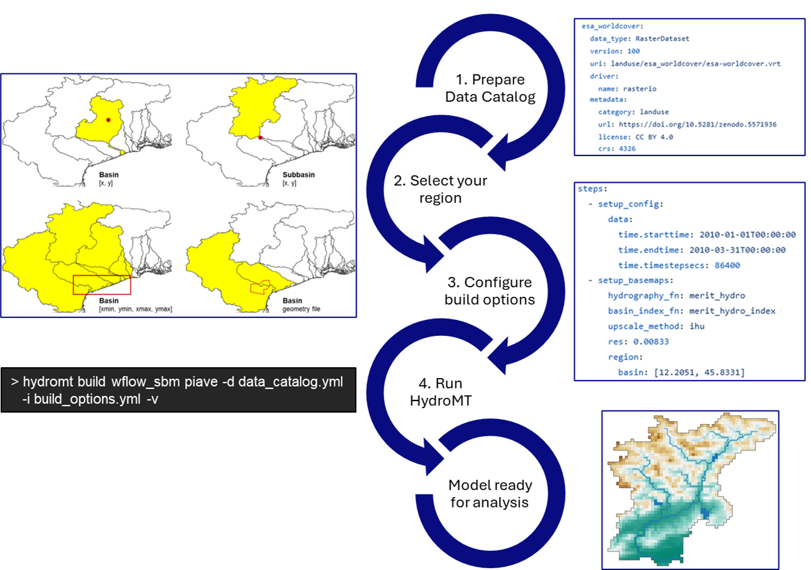

.. _quick_overview:

==============
Quick overview
==============

Common usage
============
The most common usage of HydroMT is to build a model from scratch and to update and visualize an existing model. 
Here, a high-level example of how to build a model using HydroMT is provided. Building a model from scratch with 
HydroMT involves the following generic steps: 

1) Define the input data in a :ref:`yaml data catalog file <own_catalog>` or selects available datasets from a 
   :ref:`pre-defined data catalog <existing_catalog>`.
2) Define the model :ref:`region <region>` which describes the area of interest. The model region can be based on a 
   simple bounding box or geometry, but also a (sub)(inter)basin that is delineated on-the-fly based on available 
   hydrography data.  
3) Configure the model setup in an :ref:`yaml or ini configuration file <model_config>`. A HydroMT yaml configuration file 
   represents a reproducible recipe to build a model by listing (in order of execution) the model methods and 
   their arguments. These methods and their arguments are described in the documentation. 
4) Run the HydroMT :ref:`build method <model_build>` from either command line (as shown in the figure) or Python.

Wflow build example
===================

Often, we use HydroMT together with a :ref:`plugin <plugins>` to build a model from scratch. 
Here, we illustrate this for the Wflow_ rainfall-runoff model, but the procedure is identical for other models.

Install HydroMT & model plugin
------------------------------

If you haven't already done so, first install HydroMT and the `HydroMT-Wflow plugin`_ 
in a new **hydromt** environment and activate this environment.
For more information about the installation, please refer to the :ref:`installation guide <installation_guide>`.

.. code-block:: console

    $ conda create -n hydromt -c conda-forge python=3.9 hydromt hydromt_wflow
    $ conda activate hydromt

Next, check if the installation was successful by running the command below. 
This returns the available models for HydroMT and should at least contain wflow and wflow_sediment.

.. code-block:: console

    $ hydromt --models

    >> hydroMT model plugins: wflow (vx.x.x), wflow_sediment (vx.x.x)

Build a model
-------------

Now you can create a model from raw data. To do so, you need to define 

1) the **source data**: To try out HydroMT, you can make use of the publicly available :ref:`HydroMT artifacts data catalog <existing_catalog>` 
   which contains data for the Piave basin in Northern Italy and is the default catalog if no other one is specified.
2) the **model region**: There are many options to define the :ref:`region <region>`. In this example the model region is defined 
   by the Piave subbasin upstream from an outlet point defined: ``"{'subbasin': [12.2051, 45.8331], 'strord': 4}"``
3) the **model setup configuration**: Finally, the model setup needs to be configured. Here, the example configuration from the HydroMT-Wflow repository 
   is used. You can download the *yaml* file `here (right click & save as) <https://raw.githubusercontent.com/Deltares/hydromt_wflow/main/examples/wflow_build.yaml>`_ and save it in the current directory. 
   For information about specific options, please visit the documentation of the HydroMT :ref:`plugin <plugins>` of your model of interest.

These steps are combined into the following command which saves all Wflow model files and a `hydromt.log` file 
in the `wflow_test` folder. This Wflow model instance is ready to be `run with Wflow <https://deltares.github.io/Wflow.jl/dev/user_guide/step4_running/>`_. 

.. code-block:: console

    $ hydromt build wflow ./wflow_test -r "{'subbasin': [12.2051, 45.8331], 'strord': 4}" -vv -i build_wflow.yaml

.. _Wflow: https://deltares.github.io/Wflow.jl/dev
.. _HydroMT-Wflow plugin: https://deltares.github.io/hydromt_wflow/