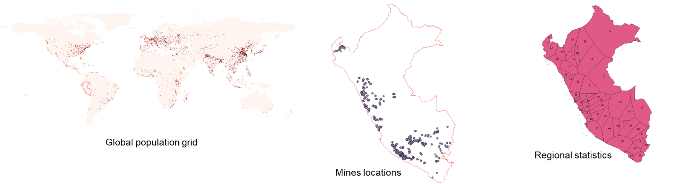
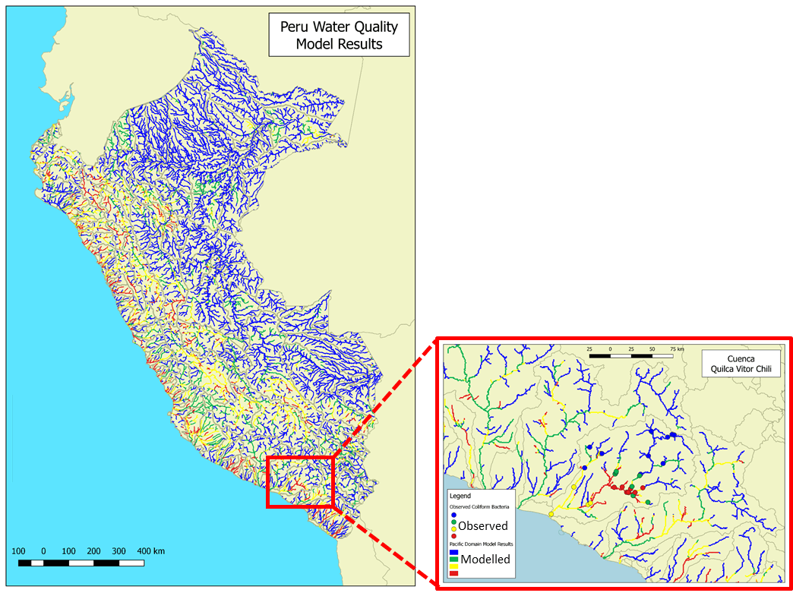

User's stories
==============

.. _use_case_mozambique_compound_flood:

Compound flooding in Mozambique
--------------------------------
An integrated flood modelling (compound flood with riverine and coastal influence) was 
developed for Mozambique based on global data with HydroMT. The wflow and SFINCS models 
were coupled offline using HydroMT to align the rivers at different resolutions and coordinate 
reference systems, and to create automatic boundary conditions.

.. image:: ../_static/mozambique_wflow_sfincs.png

The models were run  and the Cyclone Idai (March 2019) event was analysed and compared with UNOSAT 
flood extent data. ERA5 was used as precipitation input for both wflow and SFINCS in order to provide 
discharge and GTSM waterlevels. Preliminary results of SFINCS flood depths (blue) are shown below.

.. _use_case_waq_peru:

Water quality diagnostic in Peru
--------------------------------
Deltares BlueEarth new approach on model setup, **from global to local**, was applied recently 
in Peru for a nation-wide water quality diagnostic project. The wflow hydrologic and Delwaq water 
quality models were first prepared from global data and refined later using collected local data. 
For the water quality model alone, more than forty emission input data were prepared using a combination 
of global and local sources in various format using the HydroMT tool. These include global population 
and cattle grids, local mines and industry locations, regional statistics for GDP or treatment infrastructures etc. 
The wflow model was forced using local meteorological grids (PISCO). 

With this combination of local and global dataset, water quality hotspots for different substances and pressures 
could be assessed and compared to field observations (BOD, E. Coli, Nutrients, Metals from mining industry and 
chemicals). 

.. _use_case_wflow_Indonesia:

National hydrologic models for Indonesia
----------------------------------------
HydroMT was used to prepare the updated national hydrologic models for Indonesia during phase III of the Joint 
Cooperation Program between the Netherlands and Indonesia. As this is a large scale domain, seven models corresponding 
to the different Indonesian regions (BaliNusaTenggara, Java, Kalimantan, Maluku, Papua, Sumatra, Sulawesi) were derived 
at three different resolutions and integrated to the IWRM Indonesia Instrument in Delft-FEWS (using a new export to FEWS 
function from HydroMT). The clipping functionality of HydroMT can also be used to prepare sub-models for use in specific 
projects and to connect to existing RIBASIM models (using RIBASIM components within HydroMT).

.. image:: ../_static/wflow_indonesia.png

.. _use_case_waq_global:

Global water quality modelling
------------------------------
Recently, Deltares has become involved in the United Nations Environment Program, which is organized as 
a consortium of relevant organizations to develop a World Water Quality Assessment (WWQA). Deltares is 
participating in this WWQA as an opportunity to contribute to mitigating the world-wide water quality crisis, 
as well as a good way to promote our knowledge, skills, and software. Our role consists of providing a global 
assessment of the concentrations of contaminants, as well as the impact these substances have on ecology and/or 
human health. Applying the models at this scale (whole of Africa) on a 1x1 km2 resolution also provided 
us with valuable insight in the capabilities and challenges of setting up models at this scale.

