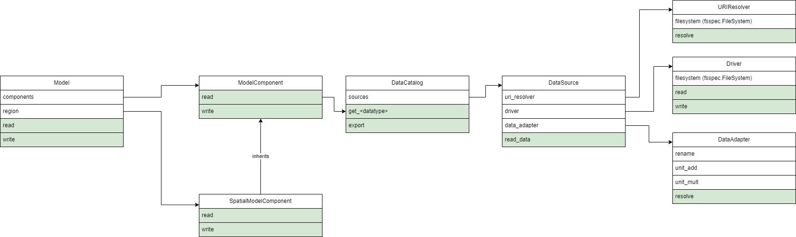

.. _architecture:

Architecture
============

HydroMT supports a large variety of models, which all require different types of data.
It is therefore important that the API that HydroMT exposes is extendable. HydroMT is
composed of a small set of key classes that support extension. In this section we walk
through these classes and describe their main responsibilities and where they interact.

.. currentmodule:: hydromt.model

Model
-----

The :Class:`Model` is the main representation of the model that is being built. A
model is built step by step by adding :Class:`~components.base.ModelComponent` s to the
Model. :ref:`Plugins` can define steps which act on these components to implement
complex interactions between different components. The area of interest for the model
can be defined by the :Class:`~components.spatial.SpatialModelComponent`. The complete
model building workflow can be encoded in a :ref:`model_yaml_setup` file.

ModelComponent
--------------

A :Class:`Model` can be populated with many different
:Class:`~components.base.ModelComponent` s. A component can represent any type of data
you have on your area of interest. This component can have many properties, but always
has a :meth:`~components.base.ModelComponent.read` and
:meth:`~components.base.ModelComponent.write` component to read in and write out data. A
:Class:`Model` must have at least one :Class:`~components.base.ModelComponent`.

.. currentmodule:: hydromt.data_catalog

DataCatalog
-----------

:Class:`Model` s need data. Where the data should be found and how it
should be loaded is defined in the :Class:`~data_Catalog.DataCatalog`. Each item in the
catalog is a :Class:`~sources.data_source.DataSource`. Users can create their own
catalogs, using a `yaml` format, or they can share their
:Class:`~predefined_catalog.PredefinedCatalog` using the :ref:`plugins` system.

DataSource
----------

The :class:`~sources.data_source.DataSource` is the python representation of a parsed
entry in the :class:`~DataCatalog`. The source is responsible for
validating the catalog entry. It also carries the
:class:`DataAdapter<adapters.data_adapter_base.DataAdapterBase>`,
:class:`~uri_resolvers.URIResolver` and
:class:`Driver<drivers.base_driver.BaseDriver>` and serves as an entrypoint to the data.
Per HydroMT data type (e.g. ``RasterDataset``, ``GeoDataFrame``), HydroMT has one
:Class:`~sources.data_source.DataSource`, e.g.
:Class:`~source.rasterdataset.RasterDatasetSource`,
:Class:`sources.geodataframe.GeoDataFrameSource`. The
:meth:`~sources.datasource.DataSource.read` method governs the full process of discovery
with the :Class:`~uri_resolvers.URIResolver`, reading data with the
:Class:`Driver<drivers.base_driver.BaseDriver>`, and transforming the data to a HydroMT
standard with a :class:`DataAdapter<adapters.data_adapter_base.DataAdapterBase>`.

URIResolver
-----------

.. currentmodule:: hydromt.data_catalog.uri_resolvers

Finding the right address where the requested data is stored is not always
straightforward. Searching for data differs between finding data in a web-service,
database, a catalog or when dealing with a certain naming convention. Exploring where
the right data can be found is implemented in the :Class:`URIResolver`. The
:Class:`URIResolver` takes a single `uri` from the data catalog, and the query
parameters from the model, such as the region, or the time range, and returns multiple
absolute paths, or `uri` s, that can be read into a single python representation (e.g.
`xarray.Dataset`). The :Class:`URIResolver` is extendable, so :ref:`Plugins` or other
code can subclass the Abstract :Class:`URIResolver` class to implement their own
conventions for data discovery.

Driver
------

.. currentmodule:: hydromt.data_catalog

The :Class:`Driver<drivers.base_driver.BaseDriver>` class is responsible for reading a
set of geospatial data formats, like a ``geojson`` file or ``zarr`` archive, into their
python in-memory representations: :Class:`geopandas.GeoDataFrame` or
:Class:`xarray.Dataset` respectively. This class can also be extended using the
:ref:`plugins`. Because the merging of different files from different
:Class:`~sources.data_source.DataSource` s can be non-trivial, the driver is responsible
to merge the different python objects coming from the driver to a single representation.
This is then returned from the :meth:`read` method. The query parameters vary per
HydroMT data type, so there is is a different driver interface per type, e.g.
:Class:`~drivers.raster.raster_dataset_driver.RasterDatasetDriver`,
:Class:`~drivers.geodataframe.geodataframe_driver.GeoDataFrameDriver`. To help with
different filesystems, the driver class is handed a :class:`fsspec.Filesystem`.

DataAdapter
-----------

.. currentmodule:: hydromt.data_catalog

The :Class:`DataAdapter<adapters.data_adapter_base.DataAdapterBase>` homogenizes the
data coming from the :Class:`Driver<drivers.base_driver.BaseDriver>`. This means slicing
the data to the right region, renaming variables, changing units, regridding and more.
The adapter has a :meth:`transform` method that takes a python object and returns the
same type, e.g. an `xr.Dataset`. This method also accepts query parameters based on the
data type, so there is a single
:Class:`DataAdapter<adapters.data_adapter_base.DataAdapterBase>` per HydroMT data type.

Architecture Diagram
====================

The above is summarized in the following architecture diagram. Only the aforementioned
methods and properties are used.

