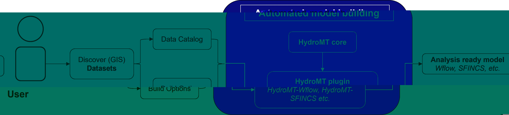

.. _intro_user_guide:

==========
User guide
==========

**HydroMT** (Hydro Model Tools) is an open-source Python package that facilitates the process of
building and analysing spatial geoscientific models with a focus on water system models.
It does so by automating the workflow to go from raw data to a complete model instance which
is ready to run and to analyse model results once the simulation has finished.
As such it is an interface between *user*, *data* and *models*.

  A sequence describing how to prepare ready-to-run models using HydroMT

In short the most common usage of hydromt is to build/update models via the following
steps (see also :ref:`the quick overview on how to use HydroMT <quick_overview>`):

1. Collect and catalog raw input data (e.g. DEM, land use, soil, climate, etc.)
2. Prepare a HydroMT configuration file to let HydroMT know which part of your model you wish to prepare, how and using which data (e.g. DEM from SRTM, MERIT Hydro, Copernicus or other source)
3. Run HydroMT to do all the data reading and processing for you either via the command line interface or via the Python API.

In this user guide, we will go through the different steps of the workflow and the
different functionalities of HydroMT. We will also provide examples and tutorials to
help you get started with HydroMT. Our user guide is separated into four (main) sections:

.. toctree::

  user_guide/index
  advanced_user/index
  plugin_dev/index
  core_dev/index
