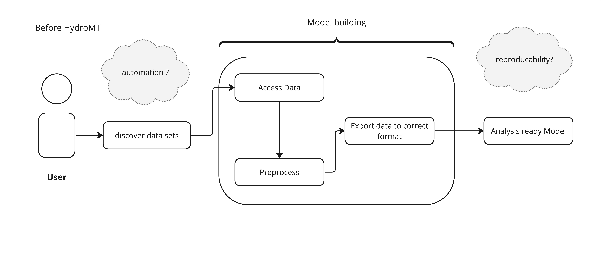
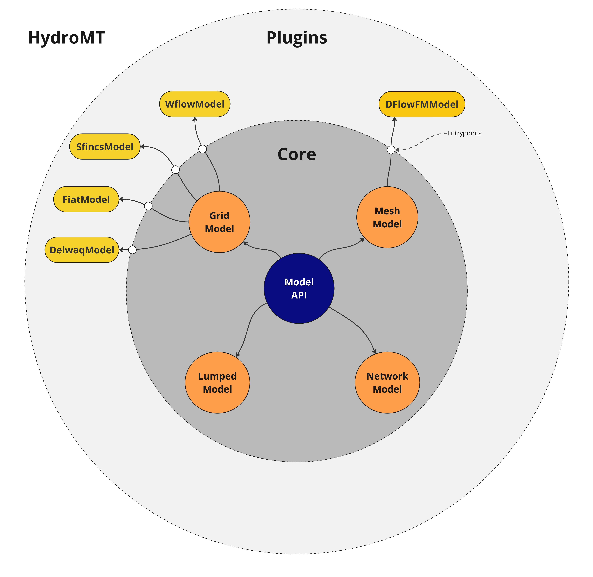
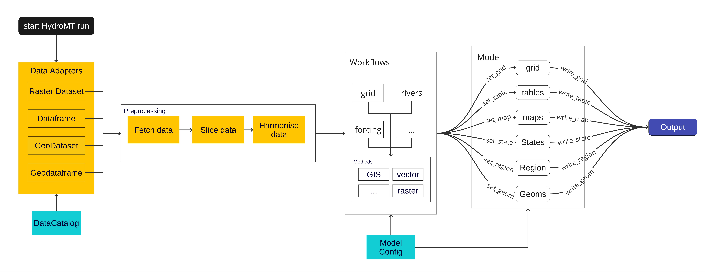

.. _detailed_intro:

Introduction to HydroMT
=======================

**HydroMT** (Hydro Model Tools) is an open-source Python package that facilitates the process of
building and analysing spatial geoscientific models with a focus on water system models.
It does so by automating the workflow to go from raw data to a complete model instance which
is ready to run and to analyse model results once the simulation has finished.
As such it is an interface between *user*, *data* and hydro *models*.

This process, before HydroMT is introduced is pictured below:

  A sequence of a typical pre-analysis workflow, before HydroMT was invented

In contrast to the image above, the same workflow using HydroMT is depicted in the next image:

.. figure:: ../../_static/hydromt_using.jpg

  A sequence describing how the pre-analysis goes using HydroMT

The main use of HydroMT is to build or update a model instance from raw data. This
includes reading and harmonizing the raw input data via the Data Catalog, and transforming
the data through a series of methods and workflows to the model specific format and requirements.
More concretely HydroMT is organized in the following way:

- **Input Data**

  HydroMT is data-agnostic through the ``Data Catalog``, which allows to read a wide range of data formats and unify
  the input data (e.g., on-the-fly renaming and unit conversion) via the HydroMT ``Drivers``. Datasets are listed and passed to HydroMT
  in a user defined data catalog :ref:`yaml file <data_yaml>`. HydroMT also provides several
  :ref:`pre-defined data catalogs <existing_catalog>` with mostly global datasets that can be used as is,
  although not all datasets in these catalogs are openly accessible.
  Currently, five different types of input data are supported by the Adapters and represented by a specific Python data
  object: gridded datasets such as DEMs or gridded spatially distributed rainfall datasets (represented
  by :ref:`RasterDataset <RasterDataset>` objects, a raster-specific type of Xarray Datasets);
  tables that can be used to, for example, convert land classes to roughness values (represented by
  Pandas :ref:`DataFrame <DataFrame>` objects); vector datasets such as administrative units or river
  center lines (represented by Geopandas :ref:`GeoDataFrame <GeoDataFrame>` objects); time series with
  associated geo-locations such as observations of discharge (represented by :ref:`GeoDataset <GeoDataset>`
  objects, a geo-specific type of Xarray Datasets); non-spatial N-dimension data (represented by Xarray
  :ref:`Dataset <Dataset>` objects).

- **Models**

  HydroMT defines any model instance through the model-agnostic ``Model`` API based on
  several possible components:
  maps, geometries, forcings, results, states, and the model simulation configuration.
  For different types of general model classes (i.e., gridded, vector, mesh and network models)
  additional model components have been defined. Each component is represented with a specific
  Python data object to provide a common interface to different model software.
  Model instances can be :ref:`built from scratch <model_build>`,
  and :ref:`existing models can be updated <model_update>` based on a pipeline of methods
  defined in a ``model build workflow`` :ref:`.yaml file <model_workflow>`. While HydroMT provides
  several general model classes that can readily be used, it can also be tailored to specific
  model software through a plugin infrastructure. These :ref:`plugins <plugins>` have the same interface,
  but with model-specific file readers, writers and workflows.

- **Methods and workflow**

  Most of the heavy work in HydroMT is done by :ref:`Methods and workflows <methods_workflows>`,
  indicated by the gear wheels in the image :ref:`arch_hydromt` below. ``Methods`` provide the low-level functionality
  such as GIS rasterization, reprojection, or zonal statistics. ``processes`` combine several methods to
  transform data to a model layer or post-process model results. Examples of workflows include the
  delineation of hydrological basins (watersheds), conversion of landuse-landcover data to model
  parameter maps, and calculation of model skill statistics. Workflows are implemented for the data
  types mentioned above to allow reusing common workflows between HydroMT plugins for different model software.

Finally user can interact with HydroMT through the following interfaces:

- **Command Line Interface (CLI)**

  The :ref:`CLI <hydromt_cli>` is a high-level interface to HydroMT. It is used to run HydroMT commands such as
  :ref:`build <model_build>`, :ref:`update <model_update>`
- **Python Interface**

  While most common functionalities can be called through the CLI, the :ref:`Python interface <hydromt_python>` offers more flexibility for advanced users.
  It allows you to e.g. interact directly with a model component :ref:`Model API <model_interface>` and apply the many
  methods and workflows available. Please find all available functions :ref: `API reference`

.. _arch_hydromt:

.. figure:: ../../_static/Architecture_model_data_input.png

  A diagram showing an overview of the architecture of HydroMT.

HydroMT is designed to be modular and extensible. Because all models are unique in their
own way, for example different model file formats(netcdf, text, binary etc.), it is built
around a plugin architecture. This plugin architecture allows to prepare ready-to-run
model instances for different model software. For less complex models or for common model file
formats. The plugin architecture of HydroMT is depicted in the following image:

  A diagram showing an overview of HydroMT and it's plugin architecture.

To summarize, the functionality of HydroMT can be broken down into five components, which are around input data,
model instances, methods and workflows. Users can interact with HydroMT through a high-level
command line interface (CLI) to build model instances from scratch, update existing model instances
or analyze model results. Furthermore, a Python interface is available that exposes
all functionality for experienced users.
A more detailed overview of how HydroMT functions internally is pictured below:

.. _arch_detail:

  A schematic overview of the sequence of steps that are involved in a HydroMT run.
