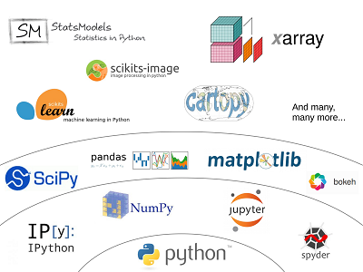

====================================================
HydroMT: Build and analyze models like a data-wizard
====================================================

Spatial environmental models (such as hydrology, hydrodynamic, groundwater, flooding, water quality and water demand), 
generally require lot's of data and data manipulations to set up. Then, once you have model results you'd like to analyze 
these and make nice graphics. This package aims to facilitate the processes of building 
a model input data, connecting models and analyzing model output data based on the state of the art 
scientific python ecosystem. Using this package every modeller will become a true data wizard.

HydroMT is part of the Model Builder Engine of Deltares |BlueEarth|. More info on `<https://blueearth.deltares.org/>`_

Latest applications with HydroMT
================================

- Coumpound flooding in Mozambique
- Water quality diagnostic in Peru
- National hydrologic models for Indonesia

Dependencies
------------
HydroMT leverages the rich scientific python eco-system by building on top of many 
packages including xarray, geopandas, rasterio, scipy, pyflwdir.

License
-------

The MIT License (MIT)

Copyright (c) 2021 Deltares

Permission is hereby granted, free of charge, to any person obtaining a copy
of this software and associated documentation files (the "Software"), to deal
in the Software without restriction, including without limitation the rights
to use, copy, modify, merge, publish, distribute, sublicense, and/or sell
copies of the Software, and to permit persons to whom the Software is
furnished to do so, subject to the following conditions:

The above copyright notice and this permission notice shall be included in
all copies or substantial portions of the Software.

THE SOFTWARE IS PROVIDED "AS IS", WITHOUT WARRANTY OF ANY KIND, EXPRESS OR
IMPLIED, INCLUDING BUT NOT LIMITED TO THE WARRANTIES OF MERCHANTABILITY,
FITNESS FOR A PARTICULAR PURPOSE AND NONINFRINGEMENT. IN NO EVENT SHALL THE
AUTHORS OR COPYRIGHT HOLDERS BE LIABLE FOR ANY CLAIM, DAMAGES OR OTHER
LIABILITY, WHETHER IN AN ACTION OF CONTRACT, TORT OR OTHERWISE, ARISING FROM,
OUT OF OR IN CONNECTION WITH THE SOFTWARE OR THE USE OR OTHER DEALINGS IN
THE SOFTWARE.

.. |BlueEarth| image:: img/BlueEarth-icon.png

.. toctree::
   :titlesonly:
   :hidden:

   getting_started
   user_guide
   api.rst
   dev_guide