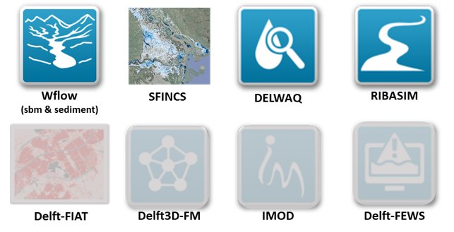

Introduction
============

What is HydroMT
---------------
HydroMT is a set of tools at the interface between **data**, **user** and hydro **models**. It assists the expert modeller in: 

- Quickly setting up base models for hydrology, groundwater, hydrodynamic, water quality and water demand
- Making maximum use of the best available global or local data
- Easily connecting different models together
- Adjusting and updating models in a consistent way
- Analyzing model outputs.

HydroMT puts data at the centre of the model building process and makes the best use of available high temporal 
and spatial resolution datasets. The approach is to enable the user to quickly get an initial model setup using 
global data, to start discussing where improvements are needed and collect the useful local data to improve the 
model and finally use it for assessment of the impact of strategies.

.. image:: img/hydromt_approach.png

Scope of HydroMT
----------------
HydroMT is a very flexible tool and helps the user to interact with the different components of model preparation so 
that the modeller can prepare exactly what he needs from the data of its choice. Currently supported models are:

- Delft-FIAT
- Delwaq
- SFINCS
- Wflow: sbm and sediment

Support for the following models is in development:

- iMOD
- RIBASIM
- Delft3D-FM
- Delft-FEWS

Plugin architecture
-------------------
HydroMT is organised via a **plugin architecture**. All the **core functionnalities** are included in the **hydromt package**. This includes:

- Command Line Interface and methods (build, update, clip).
- High end methods for raster and vector processing, GIS, configuration and flow direction functionnalities.
- Data reading, processing and export via the ``DataCatalog``.
- General workflows from input data to model data such as basin_mask or forcing.
- Definition of the hydroMT ``Model API`` class.

Implementation of hydroMT core functionnalities for specific models are realised in separate **plugin packages** (one per model). In each plugin, you can find:

- Definition of a Model class compliant to the ``Model API`` with model specific methods and attributes.
- Model specific workflows to go from input data to model data.
- Specific documentation and examples.

The plugin architecture (including known existing plugins) is:

.. image:: img/hydromt_plugins.png

The known existing plugin packages can be found at:

- Delft-FIAT: https://github.com/Deltares/hydromt_fiat
- DELWAQ: https://github.com/Deltares/hydromt_delwaq
- SFINCS: https://github.com/Deltares/hydromt_sfincs
- Wflow: https://github.com/Deltares/hydromt_wflow

.. |BlueEarth| image:: img/BlueEarth-icon.png