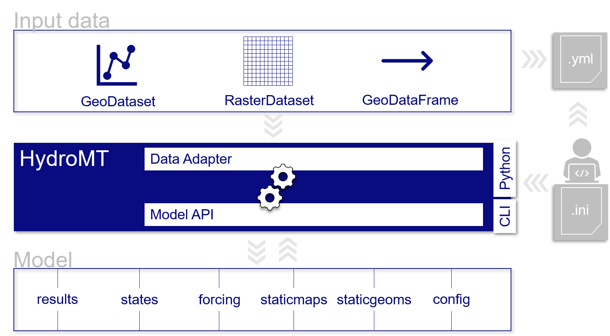

.. _intro_user_guide:

==========
User guide
==========

HydroMT is a Python package that aims to facilitate the process of building models and analyzing model results
by automating the process to go from raw data to model data. It is an interface between *user*, *data* and hydro
*models*. 

HydroMT is organized in the following way:

- **Input Data**

  HydroMT is data-agnostic through the *Data Adapter* that reads a wide range of data formats 
  and unifies the input data, see :ref:`Working with data in HydroMT <get_data>`. 
  Datasets are listed and passed to HydroMT in a user defined data catalog :ref:`yaml file <data_yaml>`.
  HydroMT also provides several :ref:`pre-defined data catalogs <existing_catalog>` with mostly global datasets 
  that can be used as is, but note that not all data is openly accessible. 

- **Models**

  HydroMT defines a model-agnostic *Model API* which provides a common interface to data components of a model
  such as (static) grids, vectors, forcing, states and simulation configuration, see :ref:`Working with models in HydroMT <model_main>`. 
  Models can be :ref:`built from scratch <model_build>` or :ref:`updated <model_update>` based on a pipeline defined in a model configuration :ref:`.ini file <model_config>`.
  The Model API for each supported model and methods to build or update that model are implemented in :ref:`model plugins <plugins>` 
  that need to be installed alongside HydroMT to work with a supported model. 
  Available model methods vary per model plugin and are documented for each plugin at their respective documentation websites.

- **Methods and workflow**

  :ref:`Methods and workflows <methods_workflows>` are the engine of HydroMT. Methods provide the low-level functionality, only accessible through the Python interface, 
  to do the required processing of common data types such as grid and vector data. Workflows combine several methods to go from raw input 
  data to a model component. Examples of workflows include the delineation of hydrological basins (watersheds), conversion of landuse-landcover to model parameter maps, etc.

A user can interact with HydroMT through the following interfaces:

- **Command Line Interface (CLI)**

  The CLI is a high-level interface to HydroMT. It is used to run HydroMT methods such as 
  :ref:`build <model_build>`, :ref:`update <model_update>` or :ref:`clip <model_clip>`.

- **Python Interface**

  While most common functionalities can be called through the CLI, the Python interface offers more flexibility for advanced users.
  It allows you to e.g. interact directly with a model through the :ref:`Model API <model_interface>` and apply the many 
  methods and workflows available. Please find all available functions :ref:`here <api_reference>`

  Schematic of HydroMT architecture

.. _terminology:

Terminology
===========

HydroMT and this documentation use a specific terminology to describe specific objects or processes.

==============================  ======================================================================================
Term                            Explanation
==============================  ======================================================================================
Command Line Interface (CLI)    high-level interface to HydroMT *build*, *update* and *clip* methods.
Configuration (HydroMT)         (.ini) file describing the complete pipeline with all methods and their arguments to 
                                *build* or *update* a model.
Data catalog                    A set of data sources available for HydroMT. It is build up from *yaml* files containing 
                                one or more data sources with information about how to read and optionally preprocess 
                                the data and meta-data about the data source.
Data source                     Input data. To be processed by HydroMT, data sources are listed in yaml files.
Model                           A set of files describing the schematization, forcing, states, simulation configuration 
                                and results for any supported model kernel.
Model attributes                Direct properties of a model, such as the model root. They can be called when using 
                                HydroMT from python.
Model component                 A model is described by HydroMT with the following components: staticmaps (regular grid data), 
                                staticgeoms (vector data), forcing, results, states, config
Model plugin                    Model software for HydroMT can build and update models and analyze its simulation results. 
                                For example *wflow*, *sfincs* etc.
Model kernel                    The model software to execute a model simulation. This is *not* part of any HydroMT plugin.
Region                          Argument of the *build* and *clip* CLI methods that specifies the region of interest where 
                                the model should be prepared / which spatial subregion should be clipped.
==============================  ======================================================================================

.. toctree::
   :maxdepth: 2
   :hidden:
   :caption: Table of Contents

   data_main.rst
   model_main.rst
   methods_main.rst  