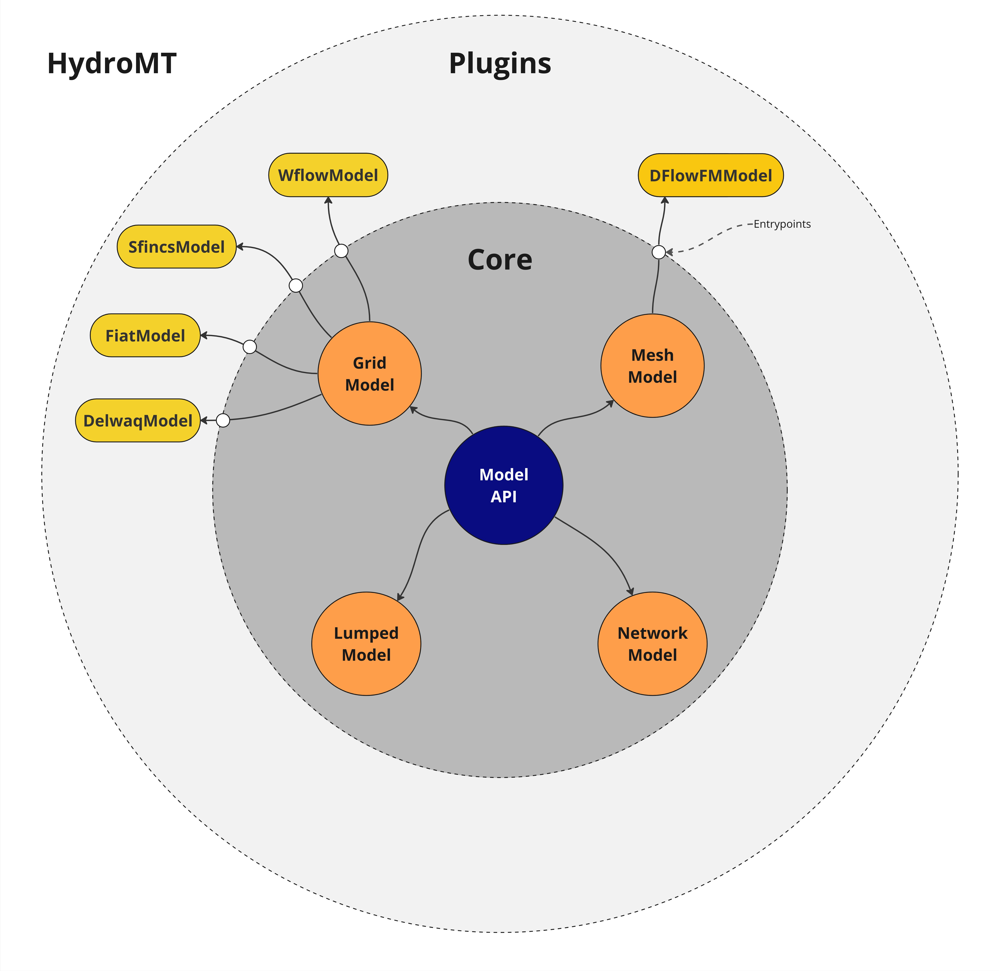

.. _intro_user_guide:

==========
User guide
==========

**HydroMT** (Hydro Model Tools) is an open-source Python package that facilitates the process of
building and analyzing spatial geoscientific models with a focus on water system models.
It does so by automating the workflow to go from raw data to a complete model instance which
is ready to run and to analyse model results once the simulation has finished.
As such it is an interface between *user*, *data* and hydro *models*.

This process, before HydroMT is introduced is pictured below:

.. figure:: ../_static/hydromt_before.jpg

  A sequence of a typical pre-analysis workflow, before HydroMT was invented

In contrast to the image above, the same workflow using HydroMT is depicted in the next image:

.. figure:: ../_static/hydromt_using.jpg

  A sequence describing how the pre-analysis goes using HydroMT

The functionality of HydroMT can be broken down into five components, which are around input data,
model instances, and methods and workflows. Users can interact with HydroMT through a high-level
command line interface (CLI) to build model instances from scratch, update existing model instances
or analyze model results. Furthermore, a Python interface is available that exposes
all functionality for experienced users. An overview of the package components and the concepts they are concerned with can be seen in the table below.

+------------------+------------------+--------------+------------------+------------+-------------+--------------------+-------------+
| Component        | Reproducibility  | Data Access  | Data Processing  | Input Data | Output Data | Plugin Connection  | Provided by |
+==================+==================+==============+==================+============+=============+====================+=============+
| Data Adapter     |                  | x            | x                | x          |             |                    | Core        |
+------------------+------------------+--------------+------------------+------------+-------------+--------------------+-------------+
| Data Catalog     | x                | x            |                  | x          |             |                    | User        |
+------------------+------------------+--------------+------------------+------------+-------------+--------------------+-------------+
| Workflow         |                  |              | x                |            | x           |                    | Core/Plugin |
+------------------+------------------+--------------+------------------+------------+-------------+--------------------+-------------+
| Model (object)   |                  |              |                  |            | x           | x                  | Core/Plugin |
+------------------+------------------+--------------+------------------+------------+-------------+--------------------+-------------+
| Model (config)   | x                |              |                  |            | x           | x                  | User        |
+------------------+------------------+--------------+------------------+------------+-------------+--------------------+-------------+

In short, there are three important concepts in HydroMT core that are important to cover:

- ``DataCatalog``: This is what is used to tell HydroMT where the data can be found and how it can be read, as well as what maintains the administration of exactly what data was used to maintain reproducibility. As a user or plugin developer you do not need to worry about the code for this, but you will need to provide a correct catalog for HydroMT to use.
- ``DataAdapters``: These are what do the actual reading of the data and get instructed and instantiated by the DataCatalog.  While a lot of the work in HydroMT happens here, plugins or users shouldn't really need to know about these beyond using the proper ``data_type`` in their configuration.
- ``Workflows``: These are functions that transform input data and can call a set of methods to for example, resample, fill nodata, reproject, derive
  other variables etc. The core has some of these workflows but you may need new ones for your plugin.
- ``Model`` (object): This is where the magic happens (as far as the plugin is concerned). We have provided some generic models that you can
  override to get basic/generic functionality, but using the model functionality is where it will be at for you. The scheme below lists the current
  relationship between the HydroMT ``Model`` and generic sub-Model classes and the know plugins.
- ``Model`` (config): While the object model is what actually performs the operations and what plugin developers are generally concerned with, the config file of the model is what instructs HydroMT and the plugins on what to do. This is the second file a user will need to provide in order to perform a HydroMT run from the commandline.

  A diagram showing an overview of HydroMT and it's plugin archetecture.

More concretely HydroMT is organized in the following way:

- **Input Data**

  HydroMT is data-agnostic through the Data Adapter, which reads a wide range of data formats and unifies
  the input data (e.g., on-the-fly renaming and unit conversion). Datasets are listed and passed to HydroMT
  in a user defined data catalog :ref:`yaml file <data_yaml>`.. HydroMT also provides several
  :ref:`pre-defined data catalogs <existing_catalog>` with mostly global datasets that can be used as is,
  although not all datasets in these catalogs are openly accessible.
  Currently, four different types of input data are supported and represented by a specific Python data
  object: gridded datasets such as DEMs or gridded spatially distributed rainfall datasets (represented
  by :ref:`RasterDataset <RasterDataset>` objects, a raster-specific type of Xarray Datasets);
  tables that can be used to, for example, convert land classes to roughness values (represented by
  Pandas :ref:`DataFrame <DataFrame>` objects); vector datasets such as administrative units or river
  center lines (represented by Geopandas :ref:`GeoDataFrame <GeoDataFrame>` objects); and time series with
  associated geo-locations such as observations of discharge (represented by :ref:`GeoDataset <GeoDataset>`
  objects, a geo-specific type of Xarray Datasets).

- **Models**

  HydroMT defines any model instance through the model-agnostic Model API based on several components:
  maps, geometries, forcings, results, states, and the model simulation configuration.
  For different types of general model classes (i.e., gridded, vector, mesh and network models)
  additional model components have been defined. Each component is represented with a specific
  Python data object to provide a common interface to different model software.
  Model instances can be :ref:`built from scratch <model_build>`,
  and :ref:`existing models can be updated <model_update>` based on a pipeline of methods
  defined in a model configuration :ref:`.yaml file <model_config>`. While HydroMT provides
  several general model classes that can readily be used, it can also be tailored to specific
  model software through a plugin infrastructure. These :ref:`plugins <plugins>` have the same interface,
  but with model-specific file readers, writers and workflows.

- **Methods and workflow**

  Most of the heavy work in HydroMT is done by :ref:`Methods and workflows <methods_workflows>`,
  indicated by the gear wheels in the image :ref:`arch` below. Methods provide the low-level functionality
  such as GIS rasterization, reprojection, or zonal statistics. Workflows combine several methods to
  transform data to a model layer or post-process model results. Examples of workflows include the
  delineation of hydrological basins (watersheds), conversion of landuse-landcover data to model
  parameter maps, and calculation of model skill statistics. Workflows are implemented for the data
  types mentioned above to allow reusing common workflows between HydroMT plugins for different model software.

A user can interact with HydroMT through the following interfaces:

- **Command Line Interface (CLI)**

  The CLI is a high-level interface to HydroMT. It is used to run HydroMT methods such as
  :ref:`build <model_build>`, :ref:`update <model_update>` or :ref:`clip <model_clip>`.

- **Python Interface**

  While most common functionalities can be called through the CLI, the Python interface offers more flexibility for advanced users.
  It allows you to e.g. interact directly with a model component :ref:`Model API <model_interface>` and apply the many
  methods and workflows available. Please find all available functions :ref:`API reference <api_reference>`

A more detailed overview of how HydroMT functions internally along with a more indepth explanation are picutred below:

.. _arch:

.. figure:: ../_static/hydromt_run.jpg

  A schematic overview of the sequence of steps that are involved in a HydroMT run.

.. _terminology:

Terminology
===========

HydroMT and this documentation use a specific terminology to describe specific objects or processes.

==============================  ======================================================================================
Term                            Explanation
==============================  ======================================================================================
Command Line Interface (CLI)    high-level interface to HydroMT *build*, *update* and *clip* methods.
Configuration (HydroMT)         (.yaml) file describing the complete pipeline with all methods and their arguments to
                                *build* or *update* a model.
Data catalog                    A set of data sources available for HydroMT. It is build up from *yaml* files containing
                                one or more data sources with information about how to read and optionally preprocess
                                the data and contains meta-data about the data source.
Data source                     Input data to be processed by HydroMT. Data sources are listed in yaml files.
Model                           A set of files describing the schematization, forcing, states, simulation configuration
                                and results for any supported model kernel and model classes. The final set of files is
                                dependent on the model type (grid, vector or mesh model for examples) or the model plugin.
Model class                     A model instance can be instantiated from different model schematization concepts. Generalized
                                model classes currently supported within HydroMT are Grid Model (distributed models), vector Model
                                (semi-distributed), Mesh Model (unstructured) and in the future
                                Network Model (relational model). Specific model classes for specific softwares have been implemented
                                as plugins, see Model plugin.
Model attributes                Direct properties of a model, such as the model root. They can be called when using
                                HydroMT from python.
Model component                 A model is described by HydroMT with the following components: maps,
                                geoms (vector data), forcing, results, states, config, grid (for a grid model), vector
                                (for a vector model), mesh (for a mesh model).
Model plugin                    Model software for which HydroMT can build and update models and analyze its simulation results.
                                For example *Wflow*, *SFINCS* etc.
Model kernel                    The model software to execute a model simulation. This is *not* part of any HydroMT plugin.
Region                          Argument of the *build* and *clip* CLI methods that specifies the region of interest where
                                the model should be prepared / which spatial subregion should be clipped.
==============================  ======================================================================================

.. toctree::
   :maxdepth: 2
   :hidden:
   :caption: Working with data in HydroMT

   data_overview.rst
   data_prepare_cat.rst
   data_types.rst
   data_existing_cat.rst
   data_conventions.rst
   ../_examples/prep_data_catalog.ipynb
   ../_examples/export_data.ipynb
   ../_examples/reading_raster_data.ipynb
   ../_examples/reading_vector_data.ipynb
   ../_examples/reading_point_data.ipynb
   ../_examples/reading_tabular_data.ipynb
   ../_examples/working_with_tiled_raster_data.ipynb

.. toctree::
   :maxdepth: 2
   :hidden:
   :caption: Working with models in HydroMT

   model_overview.rst
   model_build.rst
   model_update.rst
   model_clip.rst
   model_config.rst
   model_region.rst
   ../_examples/working_with_models_basics.ipynb
   ../_examples/working_with_models.ipynb
   ../_examples/working_with_meshmodel.ipynb
   ../_examples/delineate_basin.ipynb

.. toctree::
   :maxdepth: 2
   :hidden:
   :caption: Methods and workflows

   methods_main.rst
   methods_stats.rst
   ../_examples/working_with_raster.ipynb
   ../_examples/working_with_geodatasets.ipynb
   ../_examples/working_with_flow_directions.ipynb
   ../_examples/doing_extreme_value_analysis.ipynb
