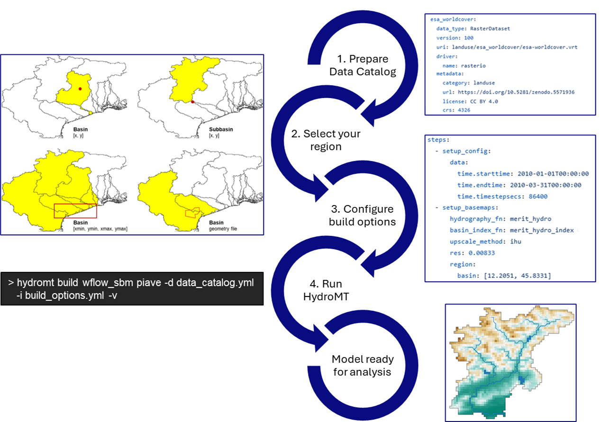

.. _detailed_intro:

=======================
Introduction to HydroMT
=======================

Why HydroMT?
============
**HydroMT** (Hydro Model Tools) is an open-source Python package that facilitates the process of
building and analyzing spatial geoscientific models with a focus on water system models.
It does so by automating the workflow to go from raw data to a complete model instance which
is ready to run and to analyze model results once the simulation has finished.
As such it is an interface between *user*, *data* and hydro *models*. Furthermore it does so in a
*fast*, *flexible*, *scalable*, *modular* and *reproducible* manner.

This process, before HydroMT is pictured below:

.. figure:: ../../_static/hydromt_before.jpg

  A sequence of a typical pre-analysis workflow, before HydroMT was invented

In contrast to the image above, the same workflow using HydroMT is depicted in the next image:

.. figure:: ../../_static/hydromt_using.jpg

  A sequence describing how the pre-analysis goes using HydroMT

With HydroMT, users can focus on the science and analysis of their models, rather than the
tedious and error-prone task of preparing input data and model files. HydroMT provides a
standardized and efficient way to build, update and analyze hydrological models, making it
easier for researchers and practitioners to work with complex water system models.

With its data-centered approach, users can with HydroMT:

- Rapidly build and update model instances anywhere in the world
- Prepare small to large-scale applications
- Use a wide range of input data formats and sources and combinations of global and local datasets thanks to the
  flexible data catalog and harmonization capabilities
- Focus on collecting and improving relevant input data rather than correcting model files
- Leverage pre-defined methods and workflows for common hydrological modeling tasks
- Reuse workflows and methods between different model software through a plugin architecture

How to use HydroMT ?
====================
.. include:: ../../overview/overview_usage_plugins.rst

.. include:: ../../overview/overview_usage_common.rst

.. include:: ../../overview/overview_usage_interface.rst

How does HydroMT work?
======================

The main use of HydroMT is to build or update a model instance from raw data. This
includes reading and harmonizing the raw input data via the Data Catalog, and transforming
the data through a series of methods and (GIS) processes to the model specific format and requirements.

Users can interact with HydroMT through a Command Line Interface (CLI) or directly
through the Python API. They tell HydroMT information on the data to use in one or several
data catalog files, and define the steps to go from raw data to a model instance in a
model build configuration (or workflow) file (for example which DEM data to use, what is the spatial
resolution, etc.). HydroMT then executes the defined steps to build or update
the model instance.

.. _arch_hydromt:

.. figure:: ../../_static/Architecture_model_data_input.png

  A diagram showing an overview of the architecture of HydroMT.

More concretely HydroMT is organized in the following way:

Input Data
----------

HydroMT is data-agnostic through the ``Data Catalog``, which allows to read a wide range of data formats and unify
the input data (e.g., on-the-fly renaming and unit conversion). Datasets are listed and passed to HydroMT
in a user defined data catalog :ref:`yaml file <data_yaml>`. HydroMT also provides several
:ref:`pre-defined data catalogs <existing_catalog>` with mostly global datasets that can be used as is,
although not all datasets in these catalogs are openly accessible.

Currently, five different types of input data are supported by HydroMT and represented by a specific Python data
object:

- gridded datasets such as DEMs or gridded spatially distributed rainfall datasets (represented
  by :ref:`RasterDataset <RasterDataset>` objects, a raster-specific extension of Xarray Datasets)
- tables or tabular data, that can be used to, for example, convert land use classes to model parameters (represented by
  Pandas :ref:`DataFrame <DataFrame>` objects)
- vector datasets such as administrative units or river center lines (represented by Geopandas :ref:`GeoDataFrame <GeoDataFrame>` objects)
- time series with associated geo-locations such as observations of discharge (represented by :ref:`GeoDataset <GeoDataset>` objects, a geo-specific extension of Xarray Datasets)
- non-spatial N-dimension data (represented by Xarray :ref:`Dataset <Dataset>` objects).

Under the hood, when HydroMT reads data from the catalog, it uses the ``uri`` provided to locate
the data, a ``Driver`` to read the data from file using the appropriate python function for the
specific format of the data (e.g. gridded datasets are read with rasterio for GeoTiff files or with xarray
for NetCDF and zarr files), and a ``Data Adapter`` to read only the correct variables, slice the data
for the required spatial region and time, and harmonize the data to HydroMT standards (e.g. renaming
variables or converting units).

Models
------

HydroMT defines any model instance through the model-agnostic ``Model`` class that is composed
of several ``Model Components``. These components typically represent a specific type of model data
or file such as:

- a configuration component, for model settings, output options, etc. (usually represented as a dictionary)
- a static spatial component, for example static gridded data or mesh data depending on the model schematization (usually represented with a xarray object)
- a forcing component, for time-varying inputs such as rainfall or temperature (usually represented with a xarray object)
- etc.

The available model components and the underlying python object containing the data will
vary depending on the model software being used. Model instances can be :ref:`built from scratch <model_build>`,
and :ref:`existing models can be updated <model_update>` step-by-step based on a pipeline of methods
defined in a ``model build workflow`` :ref:`.yaml file <model_workflow>`.

While HydroMT provides several general model components that can readily be used, each model software
is unique in its own way either because it has specific data requirements or because its input file
formats differ (netcdf or ascii or binary...). So HydroMT can easily be tailored to specific
model software through a plugin infrastructure. These :ref:`plugins <plugins>` have the same interface,
but with model-specific components, file readers, writers and workflows. In practice, you will most probably
use HydroMT together with a specific plugin for your model software of choice that HydroMT core on its own.

Methods and (GIS) processes
---------------------------

Most of the heavy work in HydroMT is done by :ref:`Methods and (GIS) processes <model_workflow>`,
indicated by the gear wheels in the :ref:`architecture diagram <arch_hydromt>` above. ``Methods`` provide the low-level functionality
such as rasterization, reprojection, or zonal statistics. ``Processes`` combine several methods to
transform the raw input data to a model layer or parameters. Examples of processes include the
delineation of hydrological basins (watersheds), conversion of landuse-landcover data to model
parameter maps, and calculation of model skill statistics.

The list of processes to use as well as their order and options are defined in a
``model build workflow`` :ref:`.yaml file <model_workflow>`. HydroMT comes with a set of
pre-defined methods and processes that can be used as is, but plugins will typically
extend this list with model-specific methods and processes.

For advanced users or developers, HydroMT exposes all methods and processes
through its Python API. Feel free to check the :ref:`API reference <api_reference>` for all available
functions.

Command Line Interface (CLI) and python interface (API)
-------------------------------------------------------
Finally users can interact with HydroMT through the following interfaces:

- **Command Line Interface (CLI)**: the CLI is a high-level interface to HydroMT. It is used to run HydroMT commands such as
  :ref:`build <model_build>`, :ref:`update <model_update>`
- **Python Interface**: while most common functionalities can be called through the CLI, the
  Python interface offers more flexibility for advanced users. It allows you to e.g. interact
  directly with a model component Model API and apply the many methods and processes available.

Check the next page of this *Overview* section for a quickstart on how to use HydroMT through the
:ref:`CLI <hydromt_cli>` and the :ref:`Python API <hydromt_python>`.

Summary
-------

To summarize, the functionality of HydroMT can be broken down into four components, which are around input data,
model instances, methods and workflows. Users can interact with HydroMT through a high-level
command line interface (CLI) to build model instances from scratch, update existing model instances
or analyze model results. Furthermore, a Python interface is available that exposes
all functionality for experienced users.

This page is an overview of the main architecture and concepts of HydroMT. If you would like to
know more, please visit the :ref:`detailed architecture <architecture>` in the developer guide.
