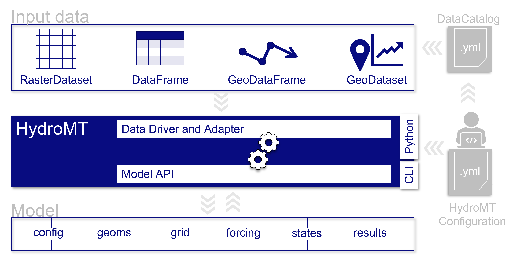

---
title: 'HydroMT: Automated and reproducible model building and analysis'
tags:
  - Python
  - reproducible model building
  - model analysis
  - hydrology
  - hydrodynamics
  - gis
authors:
  - name: Dirk Eilander^[Corresponding author] 
    orcid: 0000-0002-0951-8418
    affiliation: "1, 2" # (Multiple affiliations must be quoted)
  - name: Hélène Boisgontier
    affiliation: 1
  - name: Mark Hegnauer
    affiliation: 1
affiliations:
 - name: Deltares, The Netherlands
   index: 1
 - name: Institution for Environmental Studies (IVM), Vrije Universiteit Amsterdam, The Netherlands
   index: 2
date: 28 September 2022
bibliography: paper.bib
---

# Summary

Many impact assessment studies rely on hydrological and hydrodynamic (hydro) models. These models typically require a large set of parameters derived from different datasets and hence manual setup can be time consuming and hard to reproduce. HydroMT (Hydro Model Tools) is an open-source Python package that aims to make the process of building model instances and analyzing model results automated and reproducible. The package provides a common interface to data and model instances, workflows to transform data into models based on (hydrological) GIS and statistical methods, and various methods to analyze model results. The user can describe a full model instance including its forcing in a single configuration file based on a sequence of workflows, making the process reproducible, fast, and modular. The package has been designed with an iterative, data-centered modeling process in mind. First-order model schematizations can be built for any location in the world by leveraging open global datasets. These can later be improved by updating the input datasets with detailed local datasets. This iterative process enables the user to quickly get an initial result to then make informed decisions about the most relevant improvements and/or required data collection and to kick-start discussions with stakeholders. Furthermore, model parameter maps or forcing data can easily be modified for sensitivity analysis or calibration to support these robust modeling practices. HydroMT is successfully being used for several model software through a plugin infrastructure that allow for model specific functionality, such as readers and writers of model data formats, and can easily be extended with new model software. Currently supported model software include the distributed rainfall-runoff model Wflow, the hydrodynamic flood model SFINCS, the water quality models D-Water Quality and D-Emissions and the flood impact model Delft-FIAT.

# Statement of need

Hydrological and hydrodynamic (hydro) models are crucial to understand water systems and perform impact assessment studies [e.g.: @Undrr2022]. These models require different accurate input data. For instance, hydrodynamic models typically require bathymetric and/or topographic data, surface roughness data and boundary forcing data (e.g. water level time series). However, sufficiently accurate datasets are often not readily available and need to be converted into model-specific, sometimes idiosyncratic, file formats. For instance, many Digital Elevation Models (DEMs) require ample preprocessing as these typically represent the elevation of the top of buildings, trees or water surface, while in the model the terrain and riverbed elevation are required [@Hawker2022; @Neal2021]. Therefore, hydro models require various steps to process raw input data to model data which, if done manually, makes the process time consuming and hard to reproduce. Furthermore, it makes it hard to improve model instances based on new or updated (large) datasets, such as (global) DEMs and land use maps, potentially slowing down the uptake of such datasets for geoscientific modeling. Hence, there is a clear need for automated setup of model instances for increased transparency and reproducibility in hydro modeling [@White2020; @Hall2022].

Several open-source packages have been proposed to facilitate automated and reproducible model building. For the Soil and Water Assessment Tool (SWAT) model [@Arnold2012], the SWAT+AW package provides scripted automated workflows (AW) that are compatible with the SWAT GUI to improve reproducibility [@Chawanda2020]. For groundwater modeling the FloPy [@Bakker2016] and iMOD-Python [@Van_Engelen2022] packages provide scripting interfaces to automatically setup instances of the groundwater model MODFLOW [@Harbaugh2005]. Similarly, the LFPtools [@Sosa2020] provides scripts to setup instances of the hydrodynamic model LISFLOOD-FP [@Bates2010]. While these packages can provide automated and reproducible modeling, the functionally is model software specific and often requires scripting skills to be used. 

HydroMT (Hydro Model Tools) is an open-source Python package that aims to make the process of building a model instance and analyzing model results automated and reproducible for any hydro software. As such it contributes towards the FAIR principles of research software (FAIR4RS) which aim to increase the transparency, reproducibility, and reusability of research [@Chue_Hong2021]. Compared to other packages for automated model building, it is data- and model-agnostic meaning that data sources can easily be interchanged without additional coding and the generic model interface can be used for different model software. This makes it possible to reuse workflows to prepare input for different model software that require the same parameter (e.g. Mannning roughness derived from landuse maps) or workflows used for postprocessing of results (e.g. calculating model skill statistics), thereby providing an environment for controlled model experiments. Furthermore, it provides a high-level command line interface making it accessible to modelers without Python scripting experience. 

Several recent applications have already used HydroMT. It has been used to build instances of the hydrological Wflow model [@Van_Verseveld2022; @Imhoff2020] for climate change impact studies [@Sperna_Weiland2021]; for a large sample assessment of spatial scales in hydrological modeling [@Aerts2021]; to estimate water balance components based on global data in a data-scarce area [@Rusli2021]; and to build instances of the hydrodynamic SFINCS model [@Leijnse2021] to simulate compound flood hazard from (global) datasets in any coastal delta globally [@Eilander2022-nhess]. While the package is sufficiently general to support model software outside the domain of hydro models, the focus of many workflows is on typical hydrological data and parameters and hence hydro models benefit most from the tool. 
 
# Functionality

The functionality of HydroMT can be broken down into three components, which are around input data, model instances, and methods and workflows. Users can interact with HydroMT through a high-level command line interface (CLI) to build model instances from scratch, update existing model instances or analyze model results (in progress). Furthermore, a Python interface is available that exposes all functionality for experienced users. A schematic overview of the package is provided in \autoref{fig:schematic} and each HydroMT component is discussed below.

- **Input Data.** HydroMT is data-agnostic through the Data Adapter, which reads a wide range of data formats and unifies the input data (e.g. on-the-fly renaming and unit conversion). Datasets are listed and passed to HydroMT in a user defined data catalog yaml file. HydroMT also provides several predefined data catalogs with mostly global datasets that can be used as is, although not all datasets in these catalogs are openly accessible. Currently, four different types of input data are supported and represented by a specific Python data object: gridded datasets such as DEMs or gridded spatially distributed rainfall datasets (represented by RasterDataset objects, a raster-specific type of xarray Datasets); tables that can be used to, for example, convert land classes to roughness values (represented by Pandas DataFrame objects); vector datasets such as administrative units or river center lines (represented by Geopandas GeoDataFrame objects); and time series with associated geolocations such as observations of discharge (represented by GeoDataset objects, a geo-specific type of Xarray Datasets). 
- **Models.** HydroMT defines any model instance through the model-agnostic Model API based on several components: maps, geometries, forcing, results, states, and the model simulation configuration. For different types of general model classes (i.e. gridded, lumped, mesh and network models) additional model components have been defined. Each component is represented with a specific Python data object to provide a common interface to different model software. Model instances can be built from scratch, and existing instances can be updated based on a pipeline of methods defined in a model configuration ini file. While HydroMT provides several general model classes that can readily be used, it can also be tailored to specific model software through a plugin infrastructure. These plugins have the same interface, but with model-specific file readers and writers and workflows. 
-	**Methods and workflows.** Most of the heavy work in HydroMT is done by methods and workflows, indicated by the gear wheels in \autoref{fig:schematic}. Methods provide the low-level functionality such as GIS rasterization, reprojection, or zonal statistics. Workflows combine several methods to transform data to a model layer or postprocess model results. Examples of workflows include the delineation of hydrological basins (watersheds), conversion of landuse-landcover data to model parameter maps, and calculation of model skill statistics. Workflows are implemented for the data types mentioned above to allow reusing common workflows between HydroMT plugins for different model software.

# Example usage

Here, a high-level example of how to build a model instance using HydroMT is provided. Building a model instance from scratch with HydroMT involves the following four generic steps, see \autoref{fig:hydromt_build}. First, the user defines the input data in a *yaml* data catalog file or selects available datasets from a pre-defined data catalog. Second, the user defines the region that describes the area of interest. The region can be based on a simple bounding box or geometry, but also a (sub)(inter)basin that is delineated on-the-fly based on available hydrography data. Third, the user configures the model instance in an *ini* configuration file. This file represents a model software specific recipe to build a model instance and this is where the modeler can make choices how to best setup the model instance. It lists the workflows and their arguments in order of execution and in combination with the data catalog file provides a reproducible recipe to build a model instance. Available workflows (i.e. model *setup methods*) and their arguments are described in the documentation. Finally, the user runs the HydroMT build method from either command line or Python.

# Audience 

HydroMT is intended for students, researchers and modelers who would like to automatically build reproducible hydro models, anywhere in the world and based on the input data of their choice. For users, no Python knowledge beyond installing the package is required as HydroMT provides a CLI for common high-level functionalities. However, with Python knowledge, experienced users can directly use methods and workflows of HydroMT and interact their with model instances.

# Dependencies

HydroMT builds on many open source (Python) packages including xarray [@Hoyer2017], dask [@Dask_Development_Team2016], rasterio [@Gillies2013], rioxarray [@Snow2022], pandas [@pandas2022], geopandas [@Jordahl2021], pyflwdir [@Eilander2022], and GDAL [@GDALOGR_contributors2022].

# Acknowledgements

We thank all contributors to the code and documentation so far: Huite Bootsma, Laurène Bouaziz, Joost Buitink, Anaïs Couasnon, Rinske Hutten, Tjalling de Jong, Tim Leijnse, Xiaohan Li, Sibren Loos, Indra Marth, Daan Rooze, Willem van Verseveld, Albrecht Weerts and Hessel Winsemius. The developments have been sponsored by Deltares Strategic Research funding and the Netherlands Organization for Scientific Research (NWO) in the form of a VIDI grant (Grant No. 016.161.324).

# References